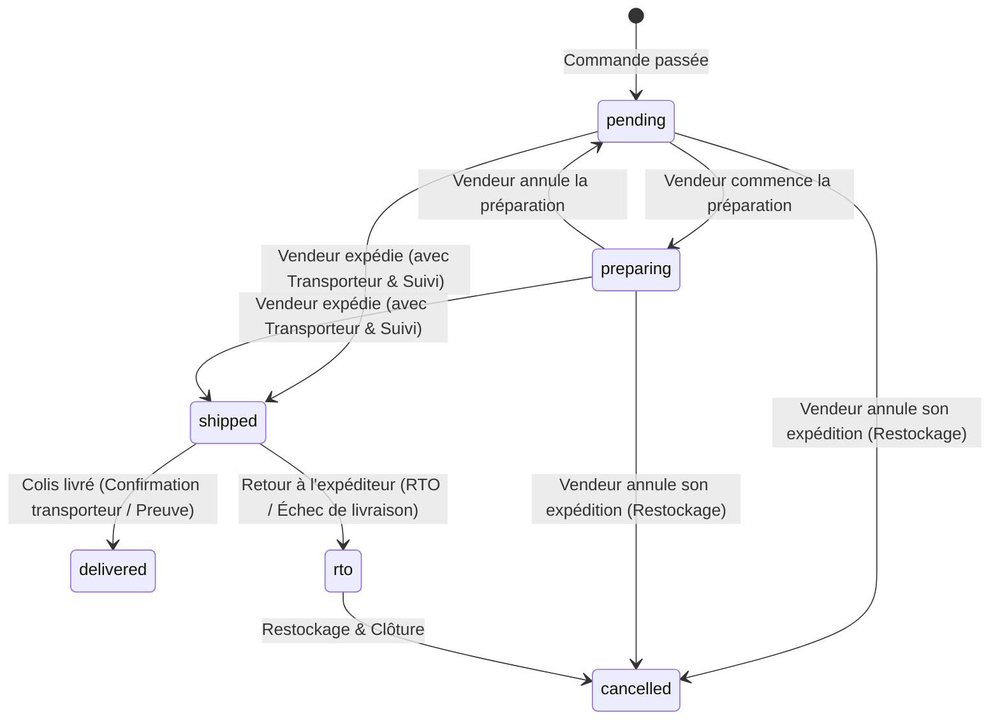

# 02 - Matrice d'États & State Machine Multi-Colis

---

## 1. Cycle de Vie des Statuts de Colis (`pd_fulfillment`)

Chaque boutique possède son propre enregistrement `pd_fulfillment` dont le statut évolue de manière strictement indépendante :



---

## 2. Table de Vérité Complète pour $N$ Colis

Soit une commande multi-boutiques composée de $T$ colis au total ($T \ge 1$) :
- $P$ : nombre de colis en attente (`status = 'pending'`)
- $Pr$ : nombre de colis en préparation (`status = 'preparing'`)
- $S$ : nombre de colis expédiés (`status = 'shipped'`)
- $D$ : nombre de colis livrés (`status = 'delivered'`)
- $C$ : nombre de colis annulés (`status = 'cancelled'`)
- $T_{\text{actif}} = T - C$ (nombre de colis actifs restant)

### Règles Logiques Déterministes :

```text
SI T_actif = 0 (tous les colis sont annulés) :
  --> Statut Global = 'cancelled'

SINON SI D = T_actif (100% des colis actifs sont livrés) :
  --> Statut Global = 'delivered'

SINON SI D > 0 ET D < T_actif (au moins 1 livré, mais d'autres actifs non livrés) :
  --> Statut Global = 'partially_delivered'

SINON SI S = T_actif (100% des colis actifs sont expédiés) :
  --> Statut Global = 'fulfilled'

SINON SI S > 0 ET (P > 0 OU Pr > 0) (au moins 1 expédié, mais d'autres en attente/préparation) :
  --> Statut Global = 'partially_shipped'

SINON SI Pr > 0 (au moins 1 en préparation, aucun expédié/livré) :
  --> Statut Global = 'processing'

SINON (tous les colis actifs sont en attente) :
  --> Statut Global = (payment_gateway IN ('cod', 'manual_mandat') ET payment_status != 'captured') ? 'payment_required' : 'pending'
```

---

## 3. Matrice de Combinaisons (Cas à 2 Boutiques)

| Colis 1 | Colis 2 | Problème Actuel | Statut Calculé Corrigé | Badge UI Global |
|---|---|---|---|---|
| `pending` | `pending` | `pending` | `pending` | 🟡 En attente |
| `preparing` | `pending` | `pending` (bloqué) | **`processing`** | 🔵 En cours de préparation |
| `preparing` | `preparing` | `pending` (bloqué) | **`processing`** | 🔵 En préparation |
| `shipped` | `pending` | `pending` (bloqué) | **`partially_shipped`** | 🟣 Partiellement expédiée (1/2) |
| `shipped` | `preparing` | `fulfilled` (faux) | **`partially_shipped`** | 🟣 Partiellement expédiée (1/2) |
| `shipped` | `shipped` | `fulfilled` | **`fulfilled`** | 🟣 Expédiée (Tous colis envoyés) |
| `delivered` | `pending` | `pending` (bloqué) | **`partially_delivered`** | 🟢 Partiellement livrée (1/2) |
| `delivered` | `shipped` | `delivered` (faux) | **`partially_delivered`** | 🟢 Partiellement livrée (1/2) |
| `delivered` | `delivered` | `delivered` | **`delivered`** | 🟢 Livrée (Commande terminée) |
| `cancelled` | `shipped` | `fulfilled` | **`fulfilled`** | 🟣 Expédiée (1 colis annulé) |
| `cancelled` | `cancelled` | `cancelled` | **`cancelled`** | 🔴 Annulée |

---

## 4. Algorithme SQL PostgreSQL Optimisé

Cet algorithme s'exécute de manière atomique à l'intérieur de `syncOrderStatusFromFulfillments` :

```sql
UPDATE pd_order o
SET status = ns.next_status,
    updated_at = NOW(),
    cancelled_at = CASE WHEN ns.next_status = 'cancelled' THEN COALESCE(o.cancelled_at, NOW()) ELSE o.cancelled_at END,
    cancelled_reason = CASE WHEN ns.next_status = 'cancelled' THEN COALESCE(o.cancelled_reason, $2) ELSE o.cancelled_reason END
FROM (
  SELECT order_id,
         COUNT(*)                                      AS total,
         COUNT(*) FILTER (WHERE status = 'pending')    AS pend,
         COUNT(*) FILTER (WHERE status = 'preparing')  AS prep,
         COUNT(*) FILTER (WHERE status = 'shipped')    AS ship,
         COUNT(*) FILTER (WHERE status = 'delivered')  AS del,
         COUNT(*) FILTER (WHERE status = 'cancelled')  AS canc
  FROM pd_fulfillment WHERE order_id = $1 GROUP BY order_id
) sub,
LATERAL (
  SELECT CASE
    -- 1. Tous annulés
    WHEN sub.canc = sub.total THEN 'cancelled'
    -- 2. Tous les colis actifs sont livrés
    WHEN sub.del > 0 AND (sub.del + sub.canc) = sub.total THEN 'delivered'
    -- 3. Au moins un colis livré, mais d'autres sont encore en transit ou préparation
    WHEN sub.del > 0 THEN 'partially_delivered'
    -- 4. Tous les colis actifs sont expédiés
    WHEN sub.ship > 0 AND (sub.ship + sub.canc) = sub.total THEN 'fulfilled'
    -- 5. Au moins un colis expédié, mais d'autres sont encore en attente ou préparation
    WHEN sub.ship > 0 THEN 'partially_shipped'
    -- 6. Au moins un colis en préparation, aucun expédié
    WHEN sub.prep > 0 THEN 'processing'
    -- 7. Tous en attente (préserver payment_required si non payé)
    ELSE CASE 
           WHEN o.payment_gateway IN ('cod', 'manual_mandat') AND o.payment_status != 'captured' THEN 'payment_required'
           ELSE 'pending'
         END
  END AS next_status
) ns
WHERE o.id = sub.order_id
  AND o.status NOT IN ('cancelled','refunded')
  AND ns.next_status IS NOT NULL
  AND o.status IS DISTINCT FROM ns.next_status;
```
