# Audit Approfondi & Solution Architecturale : Gestion des Commandes Multi-Vendeurs (Multi-Colis)
**Plateforme**: PandaMarket (Marketplace Hub & SaaS Storefronts)  
**Date d'Audit**: 31 Août 2026  
**Auditeur**: Antigravity (Google DeepMind - Gemini 3.7 Flash)  
**Dossier**: `Audit Approfondi & Solution Architecturale Gestion des Commandes Multi-Vendeurs/`

> **✅ IMPLÉMENTÉ le 31/08/2026** (Zhipu GLM 3.7 / opencode) — phases 1 à 3 déployées, migration `102` appliquée.
> Le diagnostic de cet audit est **correct** et sa direction architecturale a été retenue telle quelle, mais **le code proposé contenait 2 défauts bloquants** (dont un SQL invalide en PostgreSQL qui aurait cassé les 6 chemins d'expédition) et **6 omissions** qui auraient fait disparaître les commandes partielles du chiffre d'affaires et des compteurs.
> Détail, preuves d'exécution et corrections : **[`06-revue-critique-et-corrections-appliquees.md`](./06-revue-critique-et-corrections-appliquees.md)**.

---

## 📌 Présentation du Dossier

Ce dossier rassemble l'audit médico-légal, l'analyse architecturale et le guide complet de mise en œuvre de la solution **Multi-Colis & Synchronisation d'États Multi-Vendeurs** pour la plateforme PandaMarket.

Il répond directement au problème où une commande multi-boutiques reste bloquée au statut « En attente » (`pending`) pour l'acheteur lorsqu'un vendeur prépare, expédie ou livre sa part de la commande, et fournit l'architecture e-commerce de référence (style Amazon / AliExpress) pour découper la commande en expéditions indépendantes avec suivi en direct.

---

## 📂 Sommaire des Documents

| Fichier | Description | Contenu Clé |
|---|---|---|
| [**`01-diagnostic-et-analyse-forensique.md`**](./01-diagnostic-et-analyse-forensique.md) | Diagnostic complet du dysfonctionnement. | Fichiers incriminés, lignes de code, requêtes SQL, blocage de `syncOrderStatusFromFulfillments`, et omission des colis dans l'API acheteur. |
| [**`02-matrice-detats-et-state-machine.md`**](./02-matrice-detats-et-state-machine.md) | Matrice d'états globale et règles de transition. | Table de vérité des $N$ colis, nouveaux statuts `partially_shipped` et `partially_delivered`, et algorithme de calcul PostgreSQL. |
| [**`03-architecture-api-et-schemas.md`**](./03-architecture-api-et-schemas.md) | Spécifications API et Schémas Base de Données. | Migration SQL `086_multi_vendor_order_statuses.sql`, contrats TypeScript, et requêtes d'agrégation `fulfillments` avec sous-requêtes LATERAL. |
| [**`04-guide-dimplementation-pas-a-pas-how-to.md`**](./04-guide-dimplementation-pas-a-pas-how-to.md) | Guide technique de remédiation pas-à-pas (How-To). | Code prêt à l'emploi pour le backend (`order-fulfillment-shared.ts`, `order.service.ts`) et composant React Multi-Colis (`hub/orders/page.tsx`). |
| [**`05-master-todo-checklist.md`**](./05-master-todo-checklist.md) | Checklist d'exécution complète (TODO). | Tâches ordonnées par phase (Base de données, Backend, Frontend, Tests & QA, Déploiement). |
| [**`06-revue-critique-et-corrections-appliquees.md`**](./06-revue-critique-et-corrections-appliquees.md) | **Revue critique & implémentation** (Zhipu GLM 3.7 / opencode, 31/08/2026). | Vérification exécutable de chaque affirmation, **2 défauts bloquants corrigés** (SQL `LATERAL` illégal en PostgreSQL, numéro de migration déjà pris), **6 omissions rattrapées** (consommateurs de statut), 8 améliorations, 13 tests ajoutés. |

---

## 🔍 Schéma de Synthèse : Avant vs Après

```mermaid
graph TD
    subgraph AVANT [Architecture Antérieure - Bloquée]
        A1["Commande #123 (Vendeur A + Vendeur B)"] --> A2["Vendeur A : Expédiée 🚚"]
        A1 --> A3["Vendeur B : En attente ⏳"]
        A2 & A3 --> A4["Backend : sub.pend = 1 > 0 -> next_status = NULL"]
        A4 --> A5["pd_order.status reste 'pending'"]
        A5 --> A6["Page Acheteur : Badge 'En attente' + Liste d'articles à plat (Zéro info transporteur)"]
    end

    subgraph APRES [Architecture Multi-Colis Corrigée]
        B1["Commande #123 (Vendeur A + Vendeur B)"] --> B2["Vendeur A : Expédiée 🚚"]
        B1 --> B3["Vendeur B : En attente ⏳"]
        B2 & B3 --> B4["Backend : sub.ship > 0 AND sub.pend > 0 -> next_status = 'partially_shipped'"]
        B4 --> B5["pd_order.status devient 'partially_shipped'"]
        B5 --> B6["Page Acheteur : Badge Global 'Partiellement expédiée'"]
        B6 --> B7["📦 Colis 1 — Vendeur A : 'Expédié' + Aramex #TRK123 + Suivi direct"]
        B6 --> B8["📦 Colis 2 — Vendeur B : 'En attente de préparation'"]
    end
```

