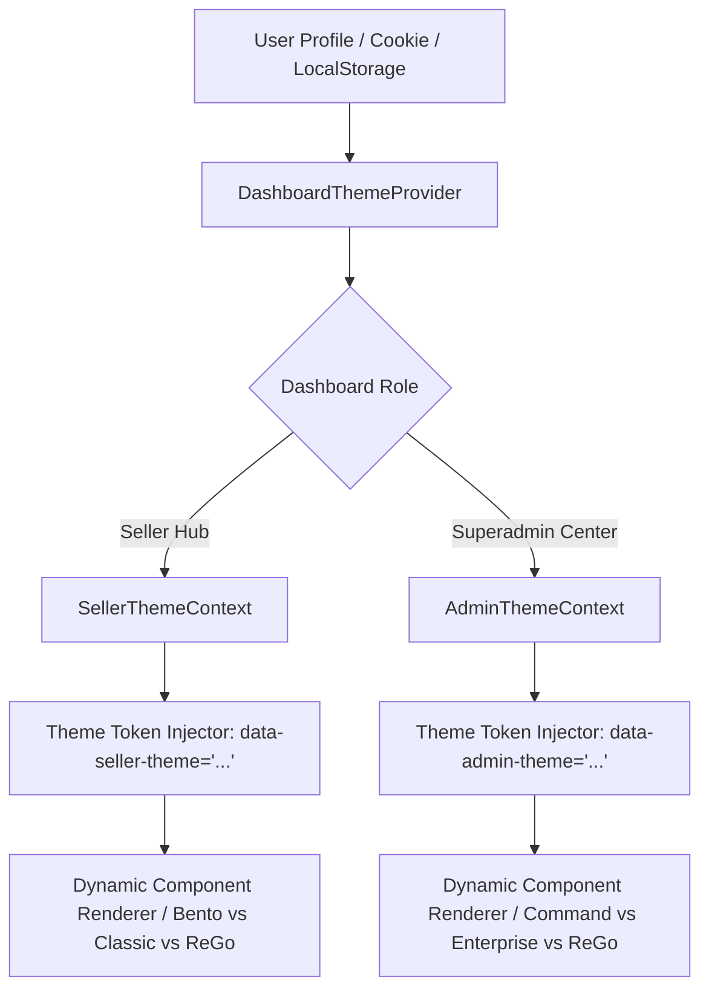

# PandaMarket Dual-Dashboard Theme Selection Architecture

## 1. Executive Summary & Design Vision

PandaMarket requires an enterprise-grade, switchable design system for **both the Seller Dashboard and the Superadmin Dashboard**.
Merchants and Platform Administrators can customize their working interface according to their workflow preferences, screen real estate, and visual aesthetic.

The architecture decouples **semantic information architecture (raw content)** from the **visual presentation layer (themes)**. When a user switches themes, the operational business logic, form inputs, table data, and actions remain identical, while the layout, styling tokens, grid densities, and visual components dynamically adapt.

---

## 2. Available Themes by Dashboard Role

### A. Seller Dashboard Themes (`/hub/dashboard/*`)

1. **Bento Cockpit (High-Density Cockpit Mode)**:
   - **Target Audience**: High-volume merchants, fast-paced operations, multi-screen operators.
   - **Visual Signature**: Modular bento-grid cards, real-time KPI status badges, micro-telemetry charts, sticky quick-action docks, anti-refus COD indicators.
   - **Density**: High data density, compact padding, interactive hover-reveal actions.

2. **Classique E-Commerce (Standard Executive Mode)**:
   - **Target Audience**: Traditional store managers, catalog creators, detailed bookkeeping.
   - **Visual Signature**: Clean vertical sidebar, linear layout hierarchy, spacious tabular grids, full-width data tables, standard pagination.
   - **Density**: Comfortable/spacious, high typography readability, minimal distractions.

3. **Minimalist Apex / ReGo (Modern Modernist Mode)**:
   - **Target Audience**: Modern digital-native brands, luxury boutiques, creative entrepreneurs.
   - **Visual Signature**: The incoming ReGo design language — refined borders, ultra-subtle elevation, sleek monochrome accents, fluid motion transitions.
   - **Density**: Balanced ergonomic density with modern aesthetics.

---

### B. Superadmin Dashboard Themes (`/(admin)/*`)

1. **Mission Control / Command Center (High-Density Telemetry Mode)**:
   - **Target Audience**: Infrastructure engineers, platform moderators, fraud compliance officers.
   - **Visual Signature**: Dark-mode primary or high-contrast slate telemetry, live cluster health meters, real-time event ticker, terminal-inspired log viewers.
   - **Density**: Maximum information density, compact data rows, instant shortcut keys.

2. **Enterprise Clean (Corporate Governance Mode)**:
   - **Target Audience**: Business auditors, general marketplace managers, customer relations leads.
   - **Visual Signature**: Crisp daylight aesthetic, structured collapsible sidebars, multi-stage approval cards, clear status taxonomy.
   - **Density**: Standard enterprise density with expansive table views.

3. **Apex Unified / ReGo (Unified Design System Mode)**:
   - **Target Audience**: Executive leadership and administrators preferring a seamless visual harmony between frontend, seller hub, and admin center.
   - **Visual Signature**: The incoming ReGo design language adapted for multi-tenant governance.
   - **Density**: Adaptive responsiveness with harmonious elevation and typography.

---

## 3. Technical Architecture & Implementation Mechanism

### A. State Management & Storage
- **Storage Strategy (Triple Redundancy)**:
  1. **HTTP-only / Client Cookie** (`pm_seller_theme`, `pm_superadmin_theme`): Ensures zero Flash of Unstyled Content (FOUC) during Next.js Server-Side Rendering (SSR).
  2. **Browser LocalStorage**: Instant optimistic UI updates across browser tabs.
  3. **User Profile DB Preferences** (`users.metadata.dashboard_theme`): Syncs theme choice across devices and browser sessions.

### B. CSS Variables & Tailwind Token Architecture
The root dashboard layout injects data attributes:
- Seller root layout: `
`
- Superadmin root layout: `
`

Tokens defined in CSS/Tailwind:
- `--surface-ground` (Page canvas background)
- `--surface-card` (Card / panel container background)
- `--surface-border` (Subtle borders and separators)
- `--accent-primary` (Brand action color)
- `--accent-hover` (Interactive state)
- `--text-primary`, `--text-secondary`, `--text-muted`
- `--table-row-hover`, `--badge-success`, `--badge-warning`, `--badge-danger`

### C. Theme Switcher UI Controls
1. **Quick Switcher in Navigation Header**:
   - Compact icon button with live theme badge (e.g. ⚡ Cockpit, 📄 Classique, 💎 ReGo).
   - Instant dropdown menu with 1-click preview and switch.
2. **Dedicated Appearance Page in Settings**:
   - `/hub/dashboard/settings` -> Tab: "Apparence & Thème"
   - `/(admin)/settings` -> Tab: "Interface & Thèmes de Contrôle"
   - Shows visual thumbnail cards, feature highlights, density comparisons, and live preview toggle.

---

## 4. Design Guidelines for Ingesting New ReGo Specs

When the user supplies the new ReGo design:
1. Extract design tokens (color palette, spacing scale, border radius, typography font family and scale, elevation shadows).
2. Register the design as the `rego` theme variant in the theme registry.
3. Map the raw content components from `DASHBOARD design/*.md` into the ReGo component structure.
4. Ensure components preserve all operational fields, filters, tables, and modal triggers without data loss.
