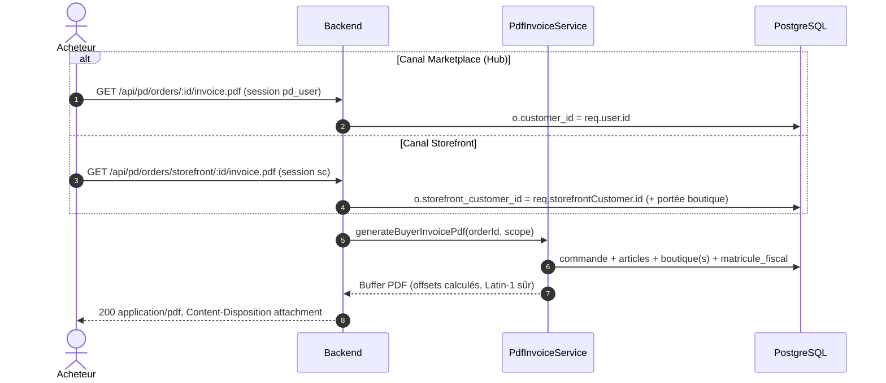

# 01 - Plan d'Implémentation : Téléchargement des Factures & Reçus par l'Acheteur
> **Révisé et corrigé le 31/08/2026** (Zhipu GLM 3.7 / opencode) — voir `00-revue-critique-et-verifications.md`. Les corrections sont marquées 🔧.

---

## 1. Problématique & Diagnostic Médico-Légal

### 1.1 Constat Actuel
- Seul le **vendeur** (`/hub/dashboard/orders`) peut imprimer une facture via `openOrderPrintDocument` (HTML imprimable) ou `GET /api/pd/seller/orders/:id/invoice.pdf`.
- **L'acheteur** n'a aucun moyen de télécharger sa facture officielle, ni sur `/hub/orders` ni sur `/store/[storeHost]/account/orders`.

### 1.2 🔧 Bugs confirmés dans le code existant (vérifiés à l'exécution)

1. **`pdf-invoice.service.ts:103`** — la requête sélectionne `price::text` alors que `pd_order_item` n'a que `unit_price` :
   ```
   column "price" of relation "pd_order_item" does not exist
   ```
   **Conséquence : l'endpoint facture VENDEUR existant échoue (500) à chaque appel.** Ce plan corrige donc aussi la facture vendeur au passage (même requête partagée).
2. **Matricule fiscal** — le plan d'origine mentionnait `store.matricule_fiscal` : **cette colonne n'existe dans aucune migration**. Le matricule est aujourd'hui hardcodé `0001234/A/M/000` (factice). → migration 104 ci-dessous.
3. **Timbre fiscal inconditionnel** — le code existant ajoute 1.000 TND à toutes les factures. En droit tunisien, le timbre fiscal de 1 TND s'applique aux **paiements en espèces** (dont COD) ; les paiements en ligne en sont exemptés. → conditionner.
4. **Builder PDF : offsets invalides** — `buildPdfFromLines` code en dur `startxref\n360` et les offsets de la table `xref`, alors que la longueur du flux de contenu **varie avec le nombre de lignes**. Les visionneuses tolèrent (recherche de `xref`), mais le PDF est techniquement malformé. → offsets calculés.
5. **Assainissement insuffisant** — `sanitizePdfText` retire les accents latins mais laisse passer l'**arabe** (titres de produits) : Helvetica (Type1 WinAnsi) ne rend pas ces glyphes → caractères illisibles. → repli Latin-1 sûr.
6. **Aucune pagination** — ≈52 lignes par page A4 au pas de 14 pt ; une commande de 30 articles déborde hors page. → limitation documentée + mitigation.

---

## 2. Exigences Légales & Fiscales (Droit Commercial Tunisien)

Mentions obligatoires sur toute facture délivrée (B2C ou B2B) :

1. **Émetteur** : raison sociale (nom de boutique), **matricule fiscal** (colonne dédiée, voir migration 104 — repli : matricule plateforme depuis `pd_platform_config`), adresse, téléphone.
2. **Client** : nom complet, téléphone, adresse de livraison.
3. **Lignes** : désignation produit + variante éventuelle, quantité, **prix unitaire TTC** (convention tunisienne B2C : les prix affichés sont TTC — ne pas inventer de ligne « HT »), sous-total.
4. **Récapitulatif** : sous-total articles, frais de livraison, **timbre fiscal 1.000 TND uniquement si paiement en espèces (COD)**, total TTC payé, date, référence unique `FAC-<8 derniers caractères>`.

🔧 **Précision TVA** (corrigée par rapport au plan d'origine) : les prix plateforme sont TTC. Ne pas afficher de « Prix unitaire HT ». Optionnel : une ligne d'information « TVA incluse » sans ventilation par taux (la ventilation exige des données fiscales par produit qui n'existent pas encore dans le schéma — l'ajouter est un chantier fiscal séparé, hors périmètre).

---

## 3. Architecture Technique & Flux de Données



🔧 **Correction structurelle majeure** : le plan d'origine vérifiait l'appartenance par `(o.customer_id = $2 OR o.storefront_customer_id = $2)`. **Faux** : ces deux colonnes référencent deux tables différentes (`pd_user` / `pd_storefront_customer`) — deux espaces d'identifiants distincts. La comparaison des deux à la même valeur est fausse dans tous les cas. Chaque canal a **sa propre route avec sa propre vérification** (règle de séparation des canaux du propriétaire).

---

## 4. Guide d'Implémentation Pas-à-Pas (How-To)

### Étape 4.0 🔧 — Migration `104_store_matricule_fiscal.sql`
(Numérotation corrigée : le plan d'origine n'avait pas de migration ; 103+ sont les prochains numéros libres — 086–102 sont pris.)

```sql
-- 104_store_matricule_fiscal.sql
ALTER TABLE pd_store ADD COLUMN IF NOT EXISTS matricule_fiscal VARCHAR(30);

-- Clé de repli plateforme (utilisée quand la boutique n'a pas de matricule)
INSERT INTO pd_platform_config (key, value, updated_at)
VALUES ('invoice_platform_matricule_fiscal', '0000000/A/M/000', NOW())
ON CONFLICT (key) DO NOTHING;
```
+ `.down.sql` correspondant (DROP COLUMN + DELETE de la clé). Enregistrer la clé dans `PLATFORM_SETTING_DEFAULTS` (section `finance`, SuperAdmin-only) **et** dans le type frontend `types/settings.ts`.

> Note : le matricule réel de la boutique est saisi par le vendeur dans ses réglages boutique (UI à prévoir côté vendeur — champ texte validé par le format tunisien `########/[A|B|C|D|...]/M/###`), ou par le KYC existant si le champ y est ajouté.

### Étape 4.1 — Correction du service `pdf-invoice.service.ts`

**4.1.1 Corriger la requête articles existante** (bug `price` → `unit_price`, corrige aussi la facture vendeur) :
```sql
SELECT i.title, i.quantity, i.unit_price::text, i.subtotal::text
FROM pd_order_item i
WHERE i.order_id = $1 AND i.store_id = $2
ORDER BY i.created_at ASC
```

**4.1.2 🔧 Builder PDF : offsets calculés** (remplacer les valeurs codées en dur) :
```typescript
private buildPdfFromLines(title: string, lines: string[]): Buffer {
  const contentStream = [ /* inchangé */ ].join('\n');
  const objects = [
    '%PDF-1.4\n',
    '1 0 obj\n<< /Type /Catalog /Pages 2 0 R >>\nendobj\n',
    '2 0 obj\n<< /Type /Pages /Kids [3 0 R] /Count 1 >>\nendobj\n',
    `3 0 obj\n<< /Type /Page /Parent 2 0 R /MediaBox [0 0 595 842] /Contents 4 0 R /Resources << /Font << /F1 << /Type /Font /Subtype /Type1 /BaseFont /Helvetica >> >> >> >>\nendobj\n`,
    `4 0 obj\n<< /Length ${Buffer.byteLength(contentStream, 'utf8')} >>\nstream\n${contentStream}\nendstream\nendobj\n`,
  ];
  // Offsets calculés : position de chaque objet dans le flux final
  const offsets: number[] = [0];
  let cursor = 0;
  for (const part of objects) { offsets.push(cursor); cursor += Buffer.byteLength(part, 'utf8'); }
  const xrefOffset = cursor;
  const pad = (n: number) => String(n).padStart(10, '0');
  const xref = `xref\n0 5\n0000000000 65535 f \n` +
    [1, 2, 3, 4].map((i) => `${pad(offsets[i])} 00000 n \n`).join('') +
    `trailer\n<< /Size 5 /Root 1 0 R >>\nstartxref\n${xrefOffset}\n%%EOF`;
  return Buffer.from(objects.join('') + xref, 'utf8');
}
```

**4.1.3 🔧 Assainissement renforcé** (arabe et hors Latin-1 → translittération/remplacement sûr) :
```typescript
private sanitizePdfText(str: string): string {
  return (str || '')
    .replace(/[\\()]/g, '')                 // échappement PDF
    .normalize('NFD')
    .replace(/[\u0300-\u036f]/g, '')         // accents latins
    .replace(/[^\x20-\x7E\xA0-\xFF]/g, '?'); // tout le reste (arabe, CJK…) : repli sûr Helvetica
}
```

**4.1.4 🔧 Génération acheteur — une méthode, deux portées** :
```typescript
type BuyerInvoiceScope =
  | { channel: 'marketplace'; userId: string }
  | { channel: 'storefront'; storefrontCustomerId: string; storeId: string };

async generateBuyerInvoicePdf(orderId: string, scope: BuyerInvoiceScope): Promise<Buffer> {
  // 1. Verrou d'appartenance PAR CANAL (jamais de OR entre les deux espaces d'ID)
  const ownership =
    scope.channel === 'marketplace'
      ? 'o.customer_id = $2'
      : 'o.storefront_customer_id = $2 AND EXISTS (SELECT 1 FROM pd_order_item oi WHERE oi.order_id = o.id AND oi.store_id = $3)';
  const params = scope.channel === 'marketplace'
    ? [orderId, scope.userId]
    : [orderId, scope.storefrontCustomerId, scope.storeId];

  const { rows: orderRows } = await query<{ /* … */ }>(
    `SELECT o.id, o.created_at, o.payment_gateway, o.payment_status,
            o.subtotal::text, o.shipping_total::text, o.total::text, o.currency,
            o.shipping_address,
            COALESCE(u.first_name || ' ' || u.last_name, sc.first_name || ' ' || sc.last_name, 'Client') AS customer_name,
            COALESCE(u.phone, sc.phone, '') AS customer_phone
     FROM pd_order o
     LEFT JOIN pd_user u ON u.id = o.customer_id
     LEFT JOIN pd_storefront_customer sc ON sc.id = o.storefront_customer_id
     WHERE o.id = $1 AND ${ownership}`,
    params,
  );
  const order = orderRows[0];
  if (!order) throw new PdNotFoundError(PdErrorCode.ORDER_NOT_FOUND, 'Commande introuvable ou accès non autorisé');

  // 2. 🔧 Gating paiement : facture réservée aux commandes réglées
  //    (captured, ou COD livré = payment_status capturé au moment de la livraison)
  if (order.payment_status !== 'captured') {
    throw new PdForbiddenError(PdErrorCode.PERM_FORBIDDEN,
      'La facture est disponible une fois le paiement confirmé');
  }

  // 3. Articles (portée boutique pour le canal storefront, toutes boutiques sinon)
  //    → unit_price corrigé, + matricule fiscal :
  const { rows: items } = await query<{ /* … */ }>(
    `SELECT i.title, i.quantity, i.unit_price::text, i.subtotal::text,
            s.name AS store_name, s.matricule_fiscal
     FROM pd_order_item i
     JOIN pd_store s ON s.id = i.store_id
     WHERE i.order_id = $1 ${scope.channel === 'storefront' ? 'AND i.store_id = $2' : ''}
     ORDER BY i.created_at ASC`,
    scope.channel === 'storefront' ? [orderId, scope.storeId] : [orderId],
  );

  // 4. 🔧 Timbre fiscal : espèces (COD) uniquement
  const timbreFiscal = order.payment_gateway === 'cod' ? 1.0 : 0.0;
  // … construction des lignes : émetteur par boutique (matricule), client,
  // lignes articles, sous-total, livraison, timbre conditionnel, total TTC
}
```

**4.1.5 🔧 Mitigation pagination** (limitation documentée) : si `lines.length > 50`, réduire le pas vertical (14 → 11 pt, en-tête 10 pt) pour tenir ~65 lignes ; au-delà, tronquer les lignes d'articles et ajouter « + N articles — facture détaillée disponible auprès du vendeur ». (La vraie pagination multi-pages est un chantier PDF séparé — le builder actuel ne gère qu'une page.)

### Étape 4.2 — Routes (ordre de déclaration important)

🔧 Deux routes distinctes (une par canal), déclarées **avant** les patrons `/:id` existants dans `order.route.ts` :

```typescript
// Canal Marketplace — session pd_user
router.get('/:id/invoice.pdf', requireAuth, asyncHandler(async (req, res) => {
  const pdf = await pdfInvoiceService.generateBuyerInvoicePdf(req.params.id, {
    channel: 'marketplace', userId: req.user!.id,
  });
  res.setHeader('Content-Type', 'application/pdf');
  res.setHeader('Content-Disposition',
    `attachment; filename="facture-${req.params.id.slice(-8).toUpperCase()}.pdf"`);
  res.status(200).send(pdf);
}));

// Canal Storefront — session pd_storefront_customer (VERROU 404 si commande d'un autre canal)
router.get('/storefront/:id/invoice.pdf', requireStorefrontCustomer, asyncHandler(async (req, res) => {
  const pdf = await pdfInvoiceService.generateBuyerInvoicePdf(req.params.id, {
    channel: 'storefront',
    storefrontCustomerId: req.storefrontCustomer!.id,
    storeId: req.storefrontCustomer!.store_id,
  });
  // … mêmes en-têtes
}));
```

> Commandes invité (ni `customer_id` ni `storefront_customer_id` — 6 en production) : aucune des deux routes ne les atteint. Acceptable et documenté.

### Étape 4.3 — Intégration UI

- `hub/orders/page.tsx` : bouton « Télécharger ma Facture (PDF) » dans le panneau déplié, **affiché si `payment_status === 'captured'`** (le JSX du plan d'origine reste valable, ajouter la condition).
- `store/[storeHost]/account/orders/page.tsx` : même bouton dans la modale de détail (même condition), pointant vers `/api/pd/orders/storefront/${id}/invoice.pdf` avec `credentials: 'include'`.

---

## 5. Checklist de Validation (TODO) — 🔧 mise à jour

- [ ] **INV-00** *(nouveau)* : Migration `104_store_matricule_fiscal` + clé repli `invoice_platform_matricule_fiscal` enregistrée dans defaults/types (4 endroits).
- [ ] **INV-01** : Corriger `price` → `unit_price` dans `pdf-invoice.service.ts` (**répare aussi la facture vendeur, cassée en production**).
- [ ] **INV-02** : `generateBuyerInvoicePdf` avec scope par canal, gating `captured`, timbre fiscal COD-only, matricule fiscal réel.
- [ ] **INV-03** : Builder PDF — offsets `xref`/`startxref` calculés + assainissement Latin-1 + mitigation > 50 lignes.
- [ ] **INV-04** : Route `GET /orders/:id/invoice.pdf` (requireAuth, `customer_id`).
- [ ] **INV-05** : Route `GET /orders/storefront/:id/invoice.pdf` (requireStorefrontCustomer, portée boutique).
- [ ] **INV-06** : Boutons UI Hub + Storefront conditionnés au paiement capturé.
- [ ] **INV-07** : Tests : unitaire (contenu des lignes : matricule, timbre conditionnel, gating 403) + intégration (marketplace acheteur ✔, storefront acheteur ✔, cross-canal → 404, commande non payée → 403, commande invité → 404).
- [ ] **INV-08** *(nouveau)* : Saisie du matricule fiscal vendeur (réglages boutique, validation format tunisien).
