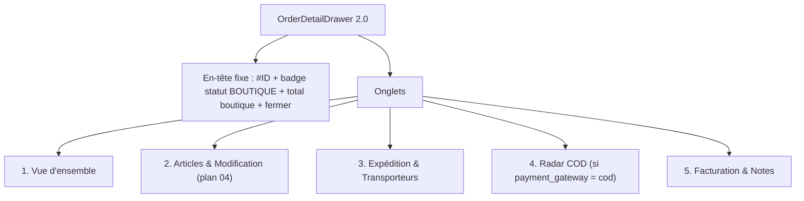

# 05 - Plan d'Implémentation : Refonte du Tiroir de Gestion Vendeur (`hub/dashboard/orders`)
> **Révisé et corrigé le 31/08/2026** (Zhipu GLM 3.7 / opencode) — voir `00-revue-critique-et-verifications.md`.

---

## 1. Problématique & Diagnostic UX/UI — 🔧 corrigé

| # | Constat du plan d'origine | Verdict de la revue |
|---|---|---|
| 1 | Modal monolithique vertical trop long | ✅ Vrai — timeline, articles, client, adresse, COD, paiements, étiquettes empilés (~4600 lignes de page) |
| 2 | Impossibilité de modifier les lignes | ✅ Vrai — dépend du **plan 04** (moteur d'édition) |
| 3 | Radar COD relégué en fin de tiroir | ✅ Vrai — les commandes COD exigent une pré-validation rapide (appel, WhatsApp, OTP) |
| 4 | « Pas d'Édition de Notes Internes » | ❌ **FAUX** — l'éditeur de note vendeur **existe** (`upsertStoreOrderNote` + UI dans le tiroir). Le point est retiré ; les notes migrent vers l'onglet « Facturation & Notes » sans être recréées |

**Reframing essential** : le tiroir contient déjà — et fonctionne — impression facture/bon (`openOrderPrintDocument`), actions de statut (préparer/expédier/livrer/RTO/annuler), outils COD (appel, WhatsApp, OTP avec le pipeline durci du 30/08), notes, remboursements, règlements livreur. Ce chantier est une **réorganisation par onglets + branchement du plan 04**, pas une réimplémentation. Le JSX du plan d'origine référençait `printInvoice`, `handleUpdateQty`, `handleStatusStep`… qui n'existent pas sous ces noms — il faut **brancher les handlers existants**.

---

## 2. Architecture du Tiroir 2.0

*(Structure en 5 onglets conservée — elle est bonne. Corrections en détail ci-dessous.)*



🔧 **Corrections structurelles** par rapport au plan d'origine :
- L'en-tête du plan n'affichait que `order.fulfillment_status` brut (valeur anglaise !) — utiliser le badge **store-scoped existant** (`storeOrderStatus`, déjà livré) + le statut marketplace en sous-ligne (déjà livré).
- Les boutons d'impression de l'en-tête appellent `openOrderPrintDocument(order, 'invoice' | 'delivery_slip', …)` — existant.
- L'onglet Expédition **réutilise** les boutons existants : « Commencer la préparation » / annuler préparation (`/prepare`, `/prepare/revert`), étiquette transporteur (`generateShippingLabel`), marquer expédié (modale transporteur + suivi existante), marquer livré (preuve existante), RTO, annulation vendeur — pas de nouveaux `handleStatusStep`.
- L'onglet COD **déplace** la carte « Diagnostic Risque COD & Pré-Validation » existante (déjà i18n-ée, OTP durci, WhatsApp 1-clic) — sans modification fonctionnelle.

---

## 3. Guide d'Implémentation

### 3.1 Extraction en composants (prérequis)

La page fait ~4600 lignes. **Extraire le tiroir** avant d'y toucher :

```
hub/dashboard/orders/
├── page.tsx                    # liste, filtres, KPI, onglets principaux (COD Radar, RTO, règlements)
└── drawer/
    ├── OrderDetailDrawer.tsx   # conteneur + onglets + état local
    ├── OverviewTab.tsx         # synthèse financière + CRM client + adresse (contenu actuel déplacé)
    ├── ItemsTab.tsx            # articles + éditeur plan 04
    ├── ShippingTab.tsx         # actions expédition existantes regroupées
    ├── CodTab.tsx              # carte COD existante déplacée
    └── BillingTab.tsx          # impression + notes existantes + remboursements/règlements
```
Props : `order`, `onRefresh` (= `openOrderDetail` existant), `onClose`, plus les handlers d'action passés en refs. La modale d'ajout de produit (plan 04) vit dans `ItemsTab` : recherche du catalogue boutique (`GET /products?store_id=…` existant), filtre `status=published`, sélection variante, contrôle de stock affiché.

### 3.2 Onglet Articles & Modification (branchement plan 04)

- Éditeur `[- Qte +]` : le bouton « − » est désactivé à `quantity === 1` (la descente à 0 passe par la corbeille) — cohérent avec `updateStoreOrderItemQuantity(≤0 → suppression)`.
- **Changement de variante** : sur chaque ligne à variante, un bouton « Changer » ouvre le sélecteur de variantes du produit (`POST …/items/:itemId/variant` du plan 04).
- Mise à jour optimiste + rollback à l'erreur ; messages serveur (stock insuffisant, augmentation interdite sur paiement capturé, type non éditable) affichés en toast d'erreur existant (`setError`).
- Confirmations : la suppression de ligne et le changement de variante demandent une confirmation inline (les deux touchent le montant payé).

### 3.3 Onglet Expédition — progresse du state existant

Les actions se désactivent selon l'état réel du colis (`canPrepare`/`canRevertPreparation`/`canFulfill`/`canMarkDelivered` existants — déjà store-scopés, déjà corrigés pour ne pas consulter l'agrégat marketplace).

### 3.4 🔧 i18n obligatoire

Le tiroir est intégralement internationalisé (~101 clés fr/en/ar livrées au fil des passes précédentes). **Tout libellé de nouvel onglet passe par `t('dashboardPages.orders.*')`** — les labels du JSX du plan d'origine (« Vue d'ensemble », « Articles & Modification », …) doivent devenir des clés (`drawerTabOverview`, `drawerTabItems`, `drawerTabShipping`, `drawerTabCod`, `drawerTabBilling` + tous les libellés internes), ajoutées aux **trois** fichiers de locales.

### 3.5 Accessibilité
- Onglets : `role="tablist"`/`role="tab"`/`aria-selected`, navigation flèches clavier.
- Le tiroir (overlay) : focus piègé dans le tiroir, `Esc` ferme, retour focus au déclencheur.

---

## 4. Checklist de Validation (TODO) — 🔧 mise à jour

- [ ] **POPUP-00** *(nouveau)* : Extraire le tiroir en `drawer/` (refactor sans changement fonctionnel — la page ne doit pas régresser).
- [ ] **POPUP-01** : Architecture 5 onglets (COD conditionné à `payment_gateway === 'cod'`), handlers existants branchés, aucun réimplémenté.
- [ ] **POPUP-02** : Éditeur `[- Qte +]` + suppression + confirmation inline, branché sur le plan 04, optimiste + rollback.
- [ ] **POPUP-03** : Modal d'ajout de produit (catalogue boutique publié, variantes, stock affiché).
- [ ] **POPUP-04** *(nouveau)* : Sélecteur de changement de variante par ligne.
- [ ] **POPUP-05** : Onglet Expédition = regroupement des actions existantes (prepare/revert, étiquette, expédier, livrer, RTO, annuler) avec désactivation par état.
- [ ] **POPUP-06** : Onglet COD = carte existante déplacée (aucune logique nouvelle).
- [ ] **POPUP-07** *(nouveau)* : Clés i18n des onglets + libellés internes (fr/en/ar).
- [ ] **POPUP-08** *(nouveau)* : Accessibilité (rôles onglets, focus trap, Esc) + test mobile 375 px.
- [x] ~~POPUP-06 (notes internes)~~ : **l'éditeur existe déjà** — simple déplacement vers l'onglet Facturation & Notes.
