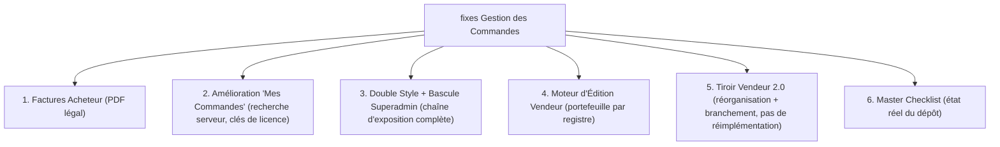

# Master Implementation Plans: PandaMarket Order Management Enhancements & Fixes
**Dossier**: `fixes Gestion des Commandes/`
**Date**: 31 Août 2026
**Auditeur & Concepteur (plans d'origine)**: Antigravity (Google DeepMind — Gemini 3.7 Flash)
**Revue critique, corrections et enrichissement**: Zhipu GLM 3.7 / opencode, 31/08/2026
**Portée**: Plans d'implémentation pour les 5 chantiers majeurs de gestion de commande

---

> ## ✅ Revue critique appliquée (31/08/2026)
>
> Chaque plan a été vérifié **par exécution** contre le code, les migrations et la base de production. Résultat :
>
> - 🔴 **1 défaut catastrophique** (plan 04) : le SQL d'ajustement de portefeuille proposé aurait **corrompu les soldes vendeurs** (somme de toutes les commandes, écrasement de l'agrégat hors registre, commission/rétention ignorées). Remplacé par une approche par registre réutilisant le pipeline de remboursement approuvé.
> - 🔴 **7 défauts bloquants** : SQL `price`→`unit_price` confirmé (facture vendeur cassée en prod), confusion des espaces d'identifiants acheteur (plan 01), table `pd_platform_settings` inexistante + valeur JSON-quotée + numéro de migration pris (plan 03), chaîne d'exposition du réglage incomplète (la clé n'aurait jamais atteint le navigateur), codes d'erreur et méthodes inexistants (plan 04).
> - ⚠️ **Diagnostic erroné** (plan 05) : l'éditeur de notes internes vendeur **existe déjà**.
> - ⚠️ **Périmètre partiellement obsolète** (plans 02/06) : les états multi-colis, cartes par boutique, tracking et filtres partiels sont **déjà livrés** (commits `39ee640`, `ca0aff1`).
>
> **Détail des vérifications et preuves : [`00-revue-critique-et-verifications.md`](./00-revue-critique-et-verifications.md)** — les plans 01–06 ont été corrigés et enrichis en conséquence (marqueurs 🔧).

---

## 📌 Présentation Générale

Cinq chantiers, revus et corrigés :

---

## 📂 Sommaire

| # | Document | Objectif & Portée | Corrections majeures (🔧) |
|---|---|---|---|
| 0 | [**`00-revue-critique-et-verifications.md`**](./00-revue-critique-et-verifications.md) | **Revue critique exécutable** | Tableau des 17 vérifications, le défaut catastrophique détaillé, les règles transversales, l'état déjà livré |
| 1 | [**`01-buyer-invoice-download-plan.md`**](./01-buyer-invoice-download-plan.md) | Facture/reçu acheteur PDF | Bug `price` confirmé (+ **répare la facture vendeur**), 2 routes par canal (espaces d'ID distincts), migration matricule fiscal, timbre COD-only, offsets xref calculés, assainissement arabe, gating paiement, pagination |
| 2 | [**`02-buyer-orders-page-enhancement-plan.md`**](./02-buyer-orders-page-enhancement-plan.md) | Amélioration « Mes Commandes » | Multi-colis/tracking **déjà fait** retiré du périmètre ; recherche **serveur** (le client-side ne filtrait que la page courante) ; filtres complétés ; clés de licence copiables ; a11y |
| 3 | [**`03-dual-style-system-and-superadmin-toggle-plan.md`**](./03-dual-style-system-and-superadmin-toggle-plan.md) | Double style + bascule admin | Table corrigée (`pd_platform_config`), valeur brute, migration **103**, **chaîne d'exposition aux 6 endroits** (liste blanche publique incluse), stepper corrigé (états terminaux), handler réel `updateSetting` |
| 4 | [**`04-seller-order-editing-engine-plan.md`**](./04-seller-order-editing-engine-plan.md) | Moteur d'édition vendeur | 🔴 **SQL portefeuille interdit** — approche par registre / porte de remboursement ; **refus de hausse sur paiement capturé** ; codes d'erreur ajoutés ; totaux complets (gross/discount/tax/port) ; colis vide annulé ; restriction types v1 ; opération dédiée changement de variante ; audit + notification acheteur |
| 5 | [**`05-seller-manage-order-popup-redesign-plan.md`**](./05-seller-manage-order-popup-redesign-plan.md) | Tiroir vendeur 2.0 | Diagnostic corrigé (notes **existantes**), reframing « brancher l'existant, ne pas réimplémenter », extraction en composants, i18n obligatoire, a11y |
| 6 | [**`06-master-todo-checklist.md`**](./06-master-todo-checklist.md) | Master checklist | État réel (5 lots déjà livrés cochés), migrations renumérotées 103/104, tâches oubliées ajoutées (erreurs, registre, notification, exposition publique, i18n, a11y) |

---

## 🛡️ Règles d'Ingénierie & Sécurité (🔧 enrichies)

1. **Séparation stricte des canaux** (règle du propriétaire) : commandes marketplace (`pd_order.customer_id`) et storefront (`pd_order.storefront_customer_id`) = espaces d'identifiants distincts, flux disjoints (vérifié en production : 0 commande ne porte les deux). Jamais de condition `OR` entre les deux ; chaque liste/route reste cantonnée à son canal.
2. **Atomicité des stocks** : transaction + `FOR UPDATE` + décréments gardés (`WHERE inventory_quantity >= $2 RETURNING`).
3. **🔴 Portefeuille = registre uniquement** : `pending_balance` ne s'écrit jamais directement ; tout ajustement passe par `walletService` (ligne `pd_wallet_transaction`, net de commission).
4. **Conformité fiscale tunisienne** : matricule fiscal réel (boutique, repli plateforme), prix TTC (pas de HT inventé), timbre fiscal 1.000 TND uniquement sur paiements en espèces (COD).
5. **Numérotation des migrations** : vérifier le dernier numéro (prochain libre : **103** ; 086–102 sont pris).
6. **i18n** : tout nouveau libellé vendeur passe par `t('dashboardPages.orders.*')` en fr/en/ar.
7. **Ne pas réimplémenter l'existant** : impression, actions de statut, outils COD, notes — les chantiers branchent ces capacités.
8. **Déploiement sans régression** : `tsc --noEmit` + lint 0 erreur + suites backend/frontend vertes + confirmation explicite du propriétaire avant tout push sur `github/main` ; migrations auto-appliquées au boot Render.
