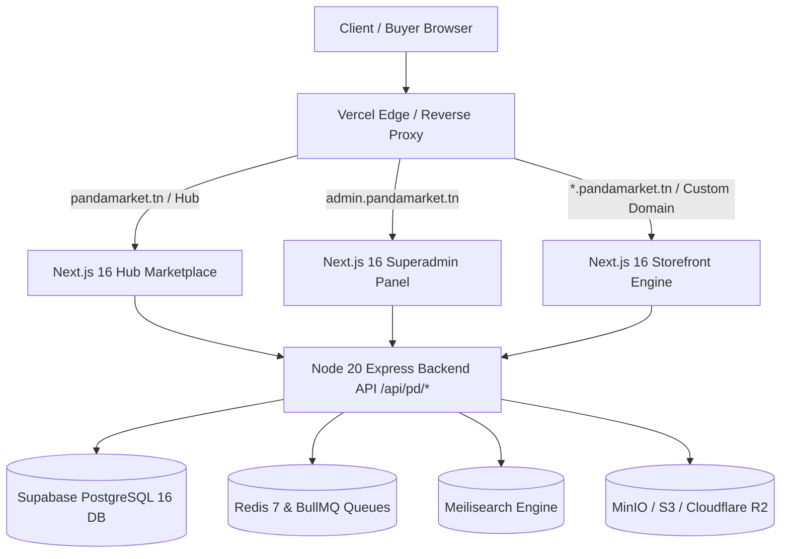

# 01 — Platform Overview & Hybrid Architecture

## 1. Concept & Business Model

PandaMarket is a Tunisian **Marketplace as a Service (MaaS)** that unifies two powerful e-commerce paradigms:
1. **Central Marketplace Hub (`pandamarket.tn` / `garbage.team`):** An Amazon/AliExpress-style discovery engine where buyers can search, filter, and buy products aggregated across thousands of verified merchants in a single checkout.
2. **Individual Multi-Tenant Storefronts (`*.pandamarket.tn` / `*.garbage.team` / custom domains):** A Shopify-style SaaS platform enabling every Tunisian seller to launch an independent, branded online store equipped with customizable themes, GrapesJS visual page builder, localized payments, and store-scoped shopping carts.

---

## 2. Monetization & Subscription Tiers

PandaMarket features a **7-tier monetization model** catering to hobbyists through enterprise brand networks:

| Tier | Price (TND/yr) | Commission | Max Products | Max Images/Prod | Custom Domain | AI Copilot | Page Builder | Direct Gateway | White-Label |
| :--- | :---: | :---: | :---: | :---: | :---: | :---: | :---: | :---: | :---: |
| **Free** | 0 | 15% | 10 | 2 | ❌ | ❌ | ❌ | ❌ (Escrow only) | ❌ |
| **Starter** | 300 | 0% | 50 | 5 | ✅ | Basic | ❌ | ❌ (Escrow only) | ❌ |
| **Regular** | 600 | 0% | 100 | 7 | ✅ | Basic | ✅ | ❌ (Escrow only) | ❌ |
| **Agency** | 1,200 | 0% | 300 | 10 | ✅ | Advanced | ✅ | ❌ (Escrow only) | ❌ |
| **Pro** | 2,400 | 0% | Unlimited | 15 | ✅ | Unlimited | ✅ | ✅ (Own Flouci/Konnect) | ❌ |
| **Golden** | 4,800 | 0% | Unlimited | 20 | ✅ | Unlimited | ✅ | ✅ (Own Flouci/Konnect) | ❌ |
| **Platinum** | 9,600 | 0% | Unlimited | 30 | ✅ | Premium | ✅ | ✅ (Own Flouci/Konnect) | ✅ |

### Add-On Monetization Channels
- **PandaMarket Ads:** Prepaid click (CPC) and impression (CPM) sponsored listings.
- **AI Token Packs:** Pay-as-you-go credits for Gemini copy generation & auto-tagging on sub-Pro tiers.
- **Premium Themes:** One-time purchase theme templates in the marketplace.

---

## 3. Core System Architecture Review

### 3.1 Backend Service Layer (Express.js + TypeScript)
- **Zero ORM Overhead:** Relies entirely on parameter-safe PostgreSQL connection pools (`pg.Pool`), transaction runners, and custom type mappers.
- **Outbox Pattern:** Transactional event publishing via `pd_outbox_event` and `outbox.worker.ts` preventing race conditions and ghost events.
- **Strict Ledger Atomicity:** Financial movements utilize `SELECT ... FOR UPDATE` row-level locks, zero floating-point arithmetic errors (all prices computed in millimes / 3 decimal places via `toMinorUnits`).

### 3.2 Frontend Layer (Next.js 16 App Router + React 19)
- **Hostname-Aware Middleware:** Classifies incoming requests in `<5ms` and rewrites to appropriate route handlers (`/hub`, `/(admin)`, or `/store/[storeHost]`).
- **Parallel Cache Architecture:** Memory-bounded isolate caching for maintenance state and store verification status.
- **Dynamic CSS Injection:** Generates CSS variables based on seller theme customizer colors without client-side flash of unstyled content (FOUC).

---

## 4. Architectural Verification Checklist

- [x] Multi-tenant hostname classification in Next.js middleware.
- [x] Parameterized SQL with zero raw string concatenation for user input.
- [x] Atomic transactions for checkout, stock deduction, and ledger crediting.
- [x] Background asynchronous job processing via BullMQ.
- [x] Webhook HMAC signature verification for payment providers.
- [ ] Automated SLA breach engine for support tickets.
- [ ] Scoped per-store GTM/Pixel injection for storefronts.
