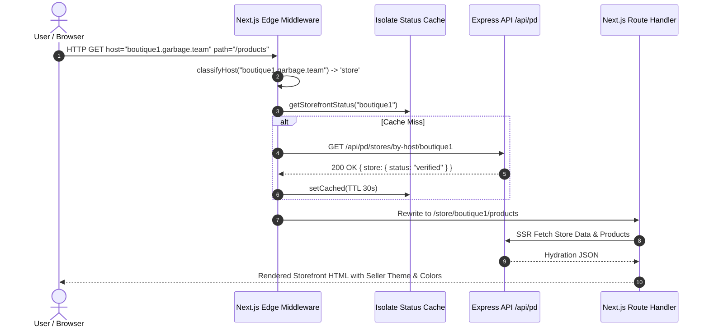

# 02 — Tech Stack & Multi-Tenancy Matrix

## 1. Complete Technology Stack Reference

```
┌─────────────────────────────────────────────────────────────────────────────┐
│ PANDAMARKET PRODUCTION STACK MATRIX                                         │
├───────────────────┬───────────────────────────────────┬─────────────────────┤
│ Layer             │ Technology & Version              │ Primary Role        │
├───────────────────┼───────────────────────────────────┼─────────────────────┤
│ Runtime Engine    │ Node.js 20 LTS (Active ES Modules)│ Backend Execution   │
│ Language          │ TypeScript 5.5+                   │ Type Soundness      │
│ Backend Server    │ Express 4.19+ (MedusaJS Style)    │ REST API Routing    │
│ Frontend Web App  │ Next.js 16.2.4 (App Router)       │ Storefront & Hub UI │
│ React Framework   │ React 19.2.4 + React DOM          │ View Components     │
│ Styling           │ Tailwind CSS v4 + LightningCSS    │ Utility Styling     │
│ Relational DB     │ Supabase PostgreSQL 16            │ Core State Storage  │
│ Cache & Queues    │ Redis 7.0 + BullMQ 5.12+          │ Async Workflows     │
│ Realtime Comms    │ Socket.IO 4.7+ (Engine.IO 6)      │ WebSockets Gateway  │
│ Search Engine     │ Meilisearch 1.8+ / PG Full-Text   │ Typo-Tolerant Search│
│ Object Storage    │ MinIO (Dev) / Cloudflare R2 (Prod)│ Media & Evidence    │
│ AI Generative API │ Google Gemini 1.5/2.0 Pro/Flash   │ SEO & Tagging AI    │
│ Image Engine      │ Sharp 0.33+ (libvips)             │ WebP Compression    │
│ Payment Gateways  │ Flouci, Konnect, Mandat, COD      │ Localized Payments  │
└───────────────────┴───────────────────────────────────┴─────────────────────┘
```

---

## 2. Multi-Tenancy Resolution Model

PandaMarket employs a **single codebase, multi-tenant hostname resolution model** executed at the Next.js middleware edge:



### Domain Routing Rules
1. **Hub Portal Hosts:** `pandamarket.tn`, `www.pandamarket.tn`, `garbage.team`, `www.garbage.team`, `localhost:3000`, `pandamarket.local:3000`
   - Maps to: `/hub/*`
   - Features: Multi-vendor catalog discovery, universal search, aggregate cart & checkout.
2. **Admin Panel Hosts:** `admin.pandamarket.tn`, `admin.garbage.team`, `admin.pandamarket.local:3000`
   - Maps to: `/(admin)/*`
   - Features: Superadmin governance, KYC queue, Ads pricing, System logs, Platform telemetry.
3. **Vendor Subdomains:** `<subdomain>.pandamarket.tn`, `<subdomain>.garbage.team`, `<subdomain>.pandamarket.local:3000`
   - Maps to: `/store/<subdomain>/*`
   - Features: Store-scoped catalog, theme customization, store-scoped cart/checkout.
4. **Custom Domains:** `boutique-artisanat.tn` (Pointed via CNAME / A-Record)
   - Maps to: `/store/boutique-artisanat.tn/*`
   - Features: Custom domain SSL auto-provisioning via Caddy/Vercel platform domains.

---

## 3. How-To: Local Multi-Tenant Setup Guide

To simulate the entire multi-tenant topology on a local development machine:

1. **Edit Hosts File (`C:\Windows\System32\drivers\etc\hosts` or `/etc/hosts`):**
   ```text
   127.0.0.1 pandamarket.local
   127.0.0.1 admin.pandamarket.local
   127.0.0.1 boutique1.pandamarket.local
   127.0.0.1 boutique2.pandamarket.local
   ```
2. **Configure Environment Variables:**
   ```bash
   # frontend/.env.local
   NEXT_PUBLIC_APP_ENV=development
   BACKEND_URL=http://localhost:9000
   ```
3. **Launch Monorepo Dev Servers:**
   ```bash
   npm run dev
   ```
4. **Test Resolution Endpoints:**
   - Hub: `http://pandamarket.local:3000/hub`
   - Admin: `http://admin.pandamarket.local:3000/dashboard`
   - Vendor Storefront: `http://boutique1.pandamarket.local:3000/`

---

## 4. Multi-Tenancy Checklist

- [x] Host header normalization (stripping ports and schemes).
- [x] Parallel status fetching for maintenance & store verification in middleware.
- [x] Storefront-scoped localStorage cart keys (`pd_cart_store_<storeId>`).
- [x] Dynamic brand and theme token resolution in SSR root layout.
- [ ] Automated CNAME verification endpoint for custom domain setup.
- [ ] Multi-region Redis cluster support for edge tenant caches.
