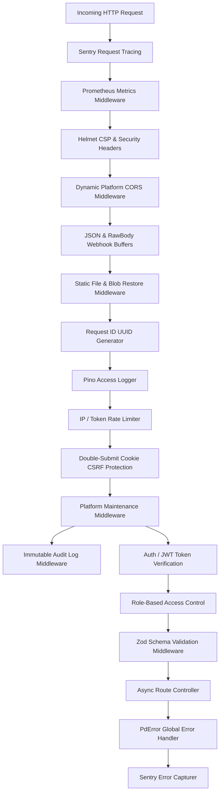

# 01 — API Routing, Architecture & Middlewares

## 1. REST Routing Topology (`/api/pd/*`)

The PandaMarket backend is constructed as an enterprise MedusaJS-style architecture with 37+ modular Express routers registered under `/api/pd`:

```
backend/src/api/
├── auth.route.ts                # Vendor/Buyer/Admin login, register, 2FA, lockout
├── storefront-auth.route.ts     # Storefront customer isolated auth & sessions
├── storefront-account.route.ts  # Storefront customer orders, addresses, downloads
├── store.route.ts               # Multi-tenant store CRUD, settings, themes
├── product.route.ts             # Products, variants, bundles, inventory
├── order.route.ts               # Checkout, multi-vendor order splitting, fulfillments
├── payment.route.ts             # Flouci, Konnect, Mandat, PayPal, webhooks
├── wallet.route.ts              # Seller escrow balances, payouts, ledger
├── subscription.route.ts        # 7-tier plans, intent creation, quota checks
├── verification.route.ts        # Manual KYC document submission
├── ai.route.ts                  # Gemini SEO, category picker, copywriter
├── ads.route.ts                 # PandaMarket Ads manager, campaigns, analytics
├── cart.route.ts                # Server-side checkout quotes, coupons, tax
├── categories.route.ts          # Multilingual category taxonomy (3 levels)
├── chat.route.ts                # Buyer-seller & buyer-admin real-time messaging
├── support.route.ts             # Support ticket system & discussion threads
├── page-builder.route.ts        # GrapesJS project data & compiled HTML/CSS
├── platform-cms.route.ts        # Marketplace legal pages & content blocks
├── analytics.route.ts           # Superadmin telemetry, heatmaps & forecasts
├── files.route.ts               # S3/R2 Presigned URLs & mock file blobs
└── admin/                       # Superadmin governance sub-routers (18 routes)
```

---

## 2. Middleware Chain & Execution Pipeline



### Critical Middleware Rules
1. **Raw Body Retention:** `express.json({ verify: (req, _res, buf) => { (req as any).rawBody = buf; } })` preserves the unparsed byte buffer necessary for cryptographic HMAC-SHA256 signature verification on inbound payment webhooks.
2. **Double-Submit CSRF Protection:** All mutating endpoints (`POST`, `PUT`, `PATCH`, `DELETE`) require the `X-CSRF-Token` header matching the signed `pd_csrf` cookie.
3. **Fail-Safe Maintenance Middleware:** When maintenance mode is active, public storefront and hub requests receive HTTP 503, while Superadmin routes (`/api/pd/admin/*`) and authenticated Admin JWTs bypass maintenance cleanly.

---

## 3. Error Handling Hierarchy (`PdError`)

The backend standardizes on a unified custom error hierarchy with typed error codes:

| Error Class | HTTP Status | Use Case |
| :--- | :---: | :--- |
| `PdValidationError` | 400 | Zod schema invalidation, illegal parameters |
| `PdAuthenticationError`| 401 | Missing/expired JWT, invalid password, 2FA required |
| `PdForbiddenError` | 403 | Tenant boundary violation, unauthorized role |
| `PdNotFoundError` | 404 | Missing resource (store, product, order, ticket) |
| `PdConflictError` | 409 | Duplicate subdomain, payment idempotency clash |
| `PdPlanRequiredError` | 402 | Action exceeds subscription tier quotas |
| `PdRateLimitError` | 429 | Rate limit exceeded |
| `PdError` | 500/502 | Unexpected failure / third-party gateway outage |

---

## 4. Middleware Audit Checklist

- [x] Webhook rawBody buffer preservation for HMAC verification.
- [x] CSRF protection enforced across all mutating routes.
- [x] Zod validation applied to 100% of request bodies and query parameters.
- [x] Sentry PII sanitization (redacting passwords, tokens, API keys).
- [ ] Add route execution latency histogram to Prometheus metrics.
