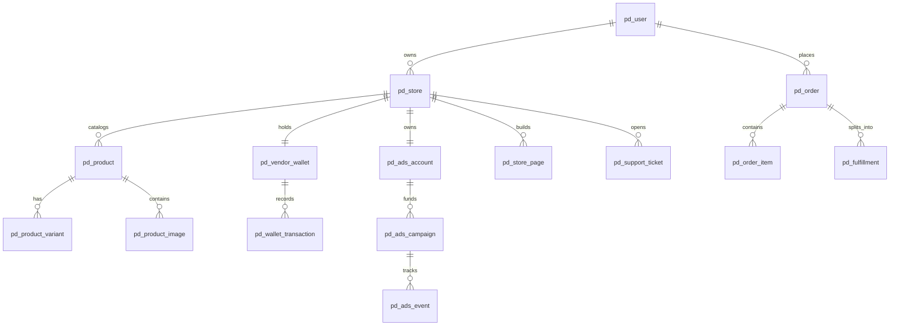

# 02 — Database Schema & Migrations (001–096)

## 1. Relational Database Overview

PandaMarket utilizes **PostgreSQL 16** (hosted on Supabase) with pure parameterized SQL queries and zero ORM overhead. All entity tables use the `pd_` prefix to prevent collision and support multi-tenant isolation.

```
Total Migration Files: 146 (.sql and .down.sql pairs)
Total Active Entities: 65+ Tables
PostgreSQL Indexes: Foreign Key indexes (085/087/095), GIN indexes on tags & JSONB, composite timeline indexes.
Row-Level Security: RLS policies enabled (086/096) with application-layer service enforcement.
```

---

## 2. Core Entity Relationship Diagram



---

## 3. Migration Evolution Summary (001–096)

| Migration Range | Subsystem Focus | Key Tables & Columns Introduced |
| :--- | :--- | :--- |
| **001 – 010** | Core Foundation & Multi-Tenancy | `pd_user`, `pd_store`, `pd_product`, `pd_order`, `pd_payment_event`, `pd_fulfillment`, `pd_vendor_wallet`. |
| **011 – 020** | Digital Products, KYC & Security | `pd_digital_license`, `pd_verification_document`, `pd_report`, `pd_system_log`, 2FA columns on `pd_user`. |
| **021 – 030** | Chat, Maintenance & Ads Foundation | `pd_chat_thread`, `pd_chat_message`, `pd_ads_account`, `pd_ads_campaign`, `pd_ads_placement`, `pd_ads_event`. |
| **031 – 040** | Page Builder Versions, Tokens & Tickets | `pd_store_page_version`, `pd_ai_provider_config`, `pd_ai_token_pack`, `pd_support_ticket`, `pd_support_ticket_message`. |
| **041 – 050** | Category Hierarchy & Multi-Lingual | `pd_marketplace_category` 3-tier hierarchy, Arabic/French translations, `pd_file_blobs` local backup table. |
| **051 – 065** | Subscriptions, Analytics & Checkout | `pd_subscription_intent`, `pd_subscription_webhook_log`, `pd_marketplace_analytics_events`, `pd_payment_attempt`. |
| **066 – 080** | Storefront Auth & Navigation | `pd_storefront_customer`, `pd_storefront_session`, `pd_store_menu`, `pd_store_footer`, `pd_checkout_quote`. |
| **081 – 096** | Enterprise Ledger & Hardening | `pd_coupon`, `pd_ledger_entry`, `pd_outbox_dlq`, `pd_review_media`, Hot/Cold FK indexes, RLS enablement. |

---

## 4. Double-Entry Accounting Invariant

Financial state transitions adhere to strict ledger accounting:
- **Seller Escrow Wallet (`pd_vendor_wallet`):**
  $$\text{Balance}_{\text{available}} + \text{Balance}_{\text{pending}} = \sum (\text{Captured Net Revenue}) - \sum (\text{Completed Withdrawals}) - \sum (\text{Refunds})$$
- **Ads Ledger (`pd_ads_account`):**
  $$\text{Balance} + \text{Reserved Balance} = \sum (\text{Refills}) + \sum (\text{Promos}) - \sum (\text{Debits}) + \sum (\text{Refunds})$$

Every balance mutation requires an associated immutable transaction record (`pd_wallet_transaction` or `pd_ads_transaction`) executed within a `SELECT ... FOR UPDATE` row lock.

---

## 5. Database Schema Checklist

- [x] Zero unparameterized SQL queries in all services and routes.
- [x] Advisory locks (`pg_advisory_xact_lock`) for concurrent checkout & payment initialization.
- [x] All 146 SQL migrations have valid up/down rollback files.
- [x] GIN indexes applied to tag arrays and JSONB search targets.
- [ ] Add automated migration smoke-test script in CI/CD pipeline.
