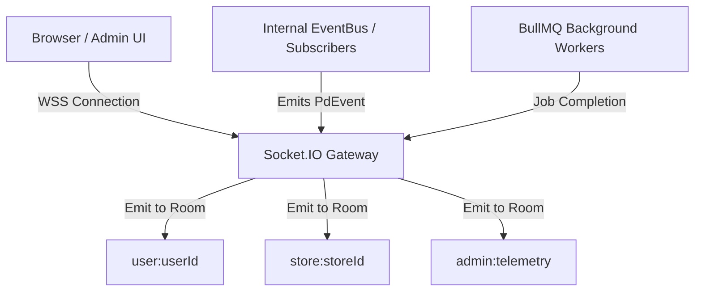

# 03 — Realtime WebSockets & Background Worker Pipeline

## 1. Realtime WebSockets Gateway (`socket-gateway.ts`)

The backend runs a unified **Socket.IO 4.7+ gateway** attached to the Express HTTP server:
- **Authentication:** JWT handshake authentication via `pd_at` cookie or `auth.token`.
- **Tenant Room Isolation:**
  - `user:<userId>` — Personal notification stream (orders, payment capture, KYC status).
  - `store:<storeId>` — Store manager room (live order ticker, low-stock alerts, ads exhaustion).
  - `chat:<threadId>` — End-to-end messaging room for buyer-seller and buyer-admin conversations.
  - `admin:telemetry` — Live Pulse stream broadcasting real-time platform velocity and heatmaps to Superadmin dashboard.



---

## 2. BullMQ Worker Architecture (10+ Background Queues)

All asynchronous and computationally intensive tasks are offloaded to **Redis 7 + BullMQ 5.12+** queues:

```
backend/src/workers/
├── ai.worker.ts                       # Gemini SEO copy generation & sharp image compression
├── email.worker.ts                    # Nodemailer SMTP transactional email delivery
├── payout.worker.ts                   # Daily scheduled seller escrow retention & payout sweeps
├── search.worker.ts                   # Meilisearch product & category indexing
├── subscription.worker.ts             # Subscription expiration, renewals & quota downgrades
├── webhook.worker.ts                  # Outgoing seller ERP webhooks with HMAC signatures
├── notification-batch.worker.ts       # Smart notification aggregation & digest batching
├── daily-digest.worker.ts             # Seller daily sales summary digests
├── payment-reconciliation.worker.ts   # Flouci/Konnect payment status reconciliation sweep
├── shipment-reconciliation.worker.ts  # Aramex/La Poste tracking status polling
└── outbox.worker.ts                   # Transactional outbox table poller (pd_outbox_event)
```

### Worker Resilience & Dead-Letter Queue (DLQ)
- **Automatic Retries:** 3 attempts with exponential backoff (`delay: 1000ms`, `factor: 2`).
- **Dead-Letter Queue:** Exhausted jobs are written to `pd_outbox_dlq` for manual inspection and admin replay.
- **In-Process Mode:** Supports `PD_RUN_WORKERS_IN_PROCESS=true` for unified single-container deployment on Render, and separate worker process runners (`npm run worker:ai`, `npm run worker:email`).

---

## 3. Worker Architecture Checklist

- [x] Socket.IO JWT authentication and room-scoped event delivery.
- [x] Outbox poller running continuously (`outboxWorker.start()`).
- [x] Recurring cron schedules registered on boot (payouts, subscriptions, reconciliation).
- [x] Exponential backoff on all email and webhook delivery attempts.
- [ ] Add Redis memory pressure monitor and queue depth dashboard in Admin panel.
