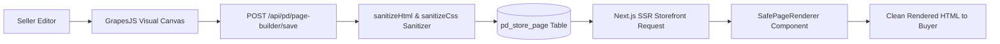

# 03 — Page Builder & GrapesJS Architecture

## 1. Visual Drag & Drop Engine

For sellers on **Regular, Agency, Pro, Golden, and Platinum** tiers, PandaMarket embeds a visual **GrapesJS 0.22+** page builder:
- **Dashboard Studio (`/hub/dashboard/page-builder`):** Visual canvas with live responsive device switches (Desktop, Tablet, Mobile), reusable e-commerce blocks, and CSS style manager.
- **Compiled SSR Rendering (`SafePageRenderer.tsx`):** The public storefront renders compiled HTML and CSS directly on the server without loading heavy GrapesJS builder JS files on client browsers.

---

## 2. Security: XSS Sanitization Pipeline

To prevent malicious JavaScript injection or phishing form attacks from stored seller page content, all HTML and CSS pass through a strict sanitization pipeline in `backend/src/services/page-builder.service.ts`:

1. **Tag Removal:** All `<script>`, `<iframe>`, `<object>`, `<embed>`, `<applet>`, `<link>`, `<meta>`, and `<base>` tags are stripped.
2. **Event Handler Scrubbing:** All `on*` attributes (`onclick`, `onload`, `onerror`, etc.) are removed.
3. **Protocol Filtering:** Disallows `javascript:`, `vbscript:`, and unsafe `data:` protocols in `href`, `src`, and `action` attributes.
4. **Form Neutralization:** `<form>` tags are transformed into `
` to prevent credentials phishing.
5. **CSS Attack Prevention:** CSS `@import`, `expression()`, `-moz-binding`, and `behavior` properties are stripped.

---

## 3. Page Builder Revision History & Draft Previews

- **Revision Versioning (`pd_store_page_version`):** Automatically creates snapshot versions on save, allowing sellers to restore previous revisions.
- **Draft Previews (`/api/pd/stores/:id/page-builder-preview?token=...`):** Signed JWT preview tokens allow sellers to preview draft changes before publishing live.
- **Homepage Override:** Sellers can designate any page builder page as their store's primary homepage (`is_homepage = true`).

---

## 4. Page Builder Checklist

- [x] GrapesJS 0.22 integration with pre-built e-commerce block gallery.
- [x] Multi-device responsive canvas (Mobile, Tablet, Desktop).
- [x] Strict HTML/CSS sanitization against XSS attacks.
- [x] Draft preview tokens with cryptographic signature.
- [ ] Add custom CSS class and animation builder blocks.
