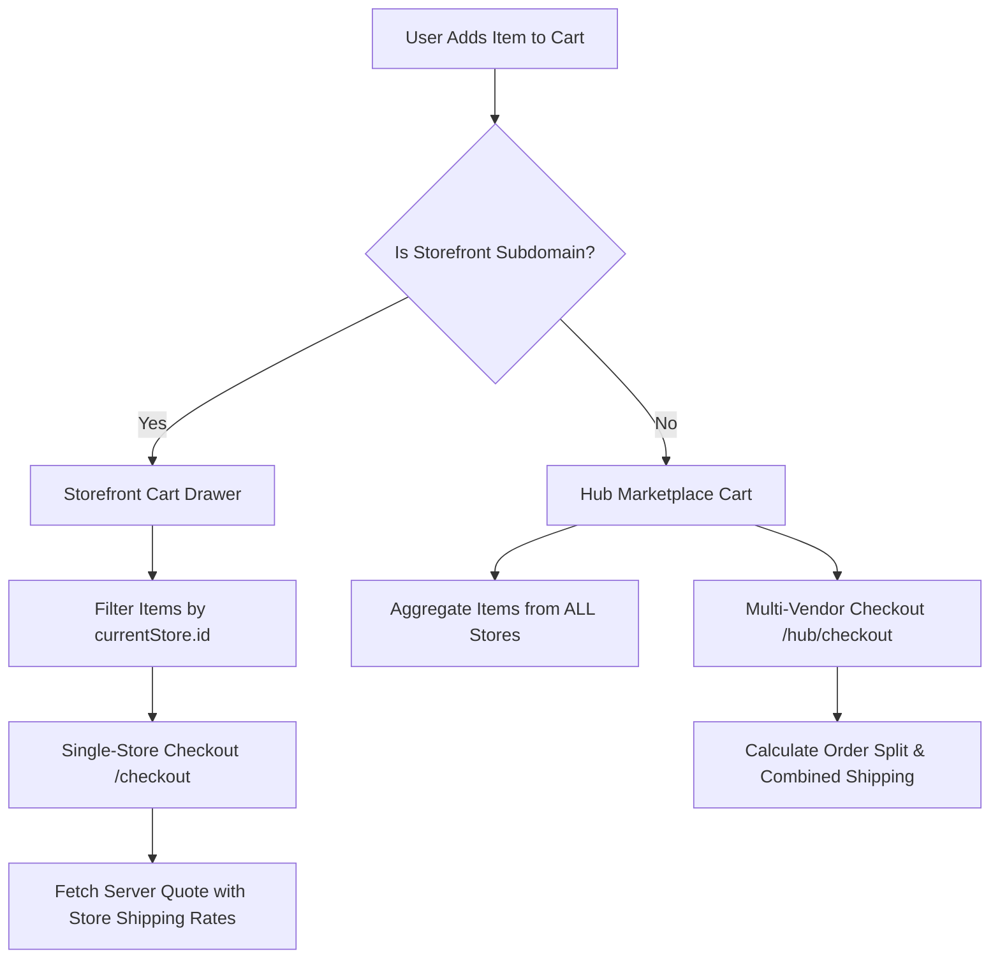

# 04 — Cart & Checkout Store Scoping

## 1. Dual Cart Architecture: Hub vs Storefront

PandaMarket maintains a clear separation between **Central Marketplace Multi-Vendor Carts** and **Storefront-Scoped Single-Vendor Carts**:

---

## 2. Server-Authoritative Checkout Quotes (`CheckoutQuoteService`)

To eliminate client-side price tampering or stale stock calculations, checkout requires a server-signed **Checkout Quote** (`pd_checkout_quote`):

1. **Quote Calculation (`POST /api/pd/cart/quote`):**
   - Resolves product prices, variant modifiers, and wholesale tiers directly from the database.
   - Applies coupon codes (`pd_coupon`) and validates minimum merchandise subtotal rules.
   - Calculates shipping fees based on shippable physical items (skips digital/service items).
   - Generates a **tamper-evident SHA-256 snapshot hash** over lines, discounts, and payment methods.
2. **Quote Expiration & Refresh:** Quotes expire after **15 minutes**. If a quote expires or stock changes during checkout, the client automatically refreshes the quote and prompts the buyer to confirm updated totals.
3. **Idempotent Order Submission (`POST /api/pd/orders/checkout`):** Submits the quote ID with an `Idempotency-Key` header, guaranteeing that network double-clicks or retries never create duplicate orders.

---

## 3. Cart & Checkout Checklist

- [x] Strict store item isolation on storefront cart and checkout pages.
- [x] Multi-vendor order splitting on Hub checkout.
- [x] Server-authoritative checkout quote with cryptographic snapshot hash.
- [x] Automatic cart clearing of purchased store items post-checkout.
- [ ] Add abandoned cart recovery email trigger for logged-in buyers.
