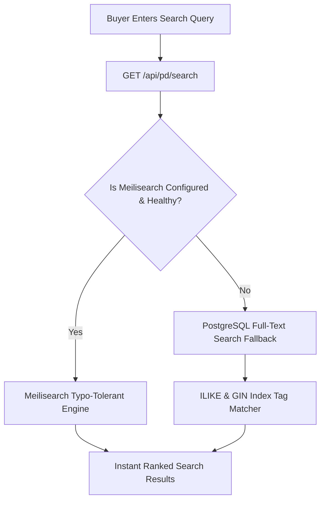

# 01 — Marketplace Hub Discovery, Search & Templates

## 1. Central Hub Architecture (`frontend/src/app/hub/*`)

The central marketplace portal (`pandamarket.tn` / `garbage.team`) aggregates all active, published products across every verified merchant in Tunisia:

```
frontend/src/app/hub/
├── page.tsx                   # Dynamic template selection (Panda, AliExpress, AliExpress2)
├── search/                    # Universal search with faceted filters & price ranges
├── category/[slug]/           # 3-tier hierarchical category pages
├── products/[slug]/           # Marketplace product detail page with seller info badge
├── pricing/                   # 7-tier subscription pricing page & comparison matrix
└── vendor-signup/             # Fast merchant onboarding & registration flow
```

---

## 2. Hub Template Layouts

The Hub supports multiple configurable layout engines controlled by `marketplace_theme` and `hub_homepage_layout` settings:

1. **AliExpress2 (Premium Dark Deals Template):**
   - Dark aesthetic with high-energy flash deals grid and countdown badges.
   - Side category rail and banner hero section.
   - Featured marketplace categories and trust guarantees.
2. **Panda Classic Template:**
   - Amazon-style clean white canvas with hero carousel and merchant showcase.
   - Dense multi-column category discovery cards.

### Recommended Hub Expansion (P1 Priority)
- **Full Amazon Department Mega-Menu:** Multi-level hover flyout menu listing all 24 parent departments and subcategories.
- **Recently Viewed Rail:** LocalStorage-synced horizontal product strip.
- **Top Sellers Carousel:** Algorithmic ranking based on verified merchant order volume.

---

## 3. Universal Search Pipeline



- **Resilient Fallback:** If Meilisearch is not configured, the backend automatically executes a parameterized PostgreSQL fallback querying title, description, SKU, vendor tags, and AI interest tags without throwing a 500 error.
- **Search Autocomplete:** `/api/pd/search/suggest` provides instant search-as-you-type suggestions.

---

## 4. Hub Marketplace Checklist

- [x] Resilient search pipeline with transparent PostgreSQL fallback.
- [x] Multi-facet category, price range, and stock status filters.
- [x] Dynamic marketplace layout switcher (Panda vs AliExpress2).
- [ ] Implement Amazon-style full department mega-menu.
- [ ] Add recently-viewed products localStorage rail.
