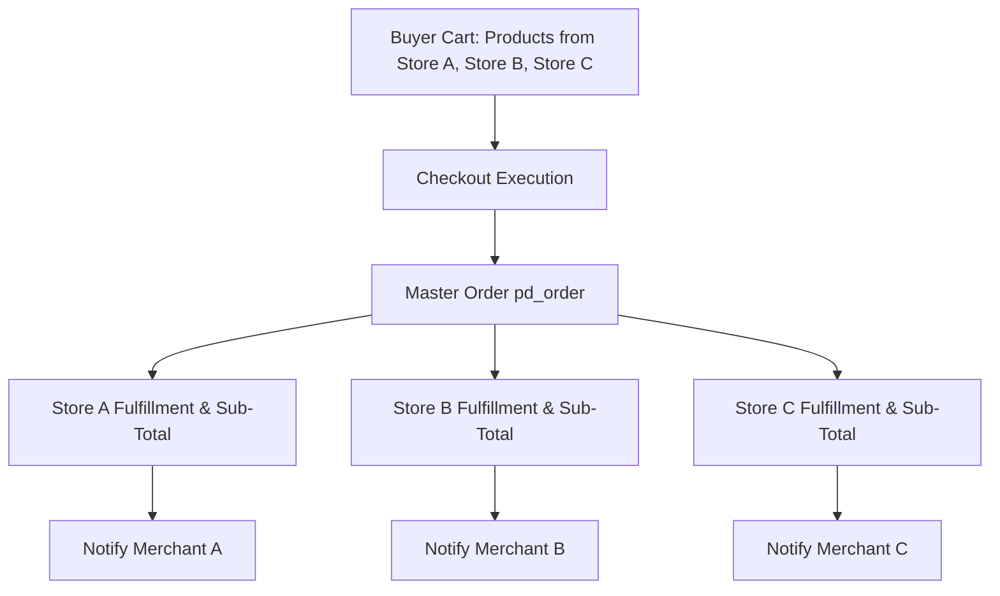
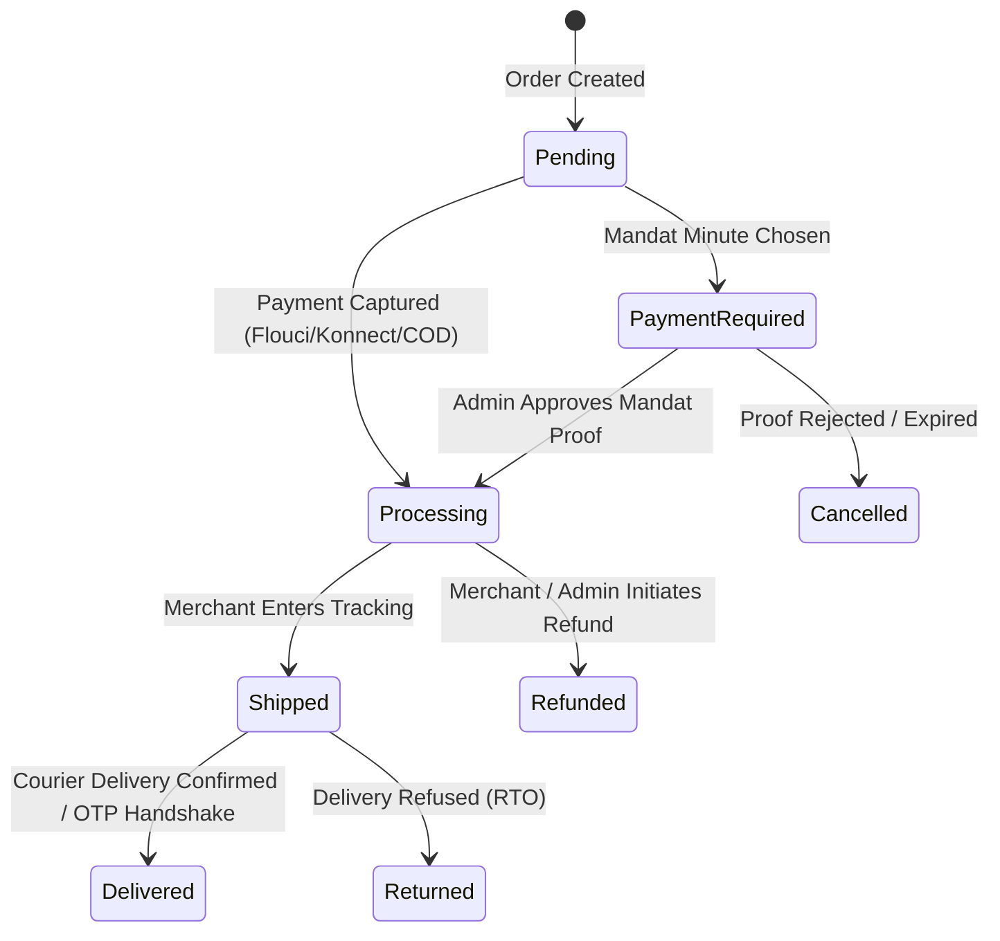

# 02 — Multi-Vendor Order Splitting & Fulfillment Lifecycle

## 1. Order Splitting Architecture (`OrderService`)

When a buyer checks out on the Central Hub with products from multiple merchants, the platform executes an automated **Order Splitting** transaction:

### Invariants:
1. **Single Payment Transaction:** The buyer completes one payment transaction for the grand total.
2. **Distinct Fulfillment Records:** Each vendor receives an isolated fulfillment record (`pd_fulfillment`) with their specific line items, subtotal, and shipping fee.
3. **Independent Lifecycles:** Vendor A shipping their package does not block or modify Vendor B's fulfillment status.

---

## 2. Order State Machine

### Stock Decrement & Restocking
- **Atomic Stock Reservation:** Stock is decremented inside the order creation transaction using `UPDATE pd_product SET stock = stock - $qty WHERE id = $id AND stock >= $qty`.
- **Restocking on Cancellation:** If an order is cancelled or refunded before delivery, stock is automatically returned to inventory.

---

## 3. Order Lifecycle Checklist

- [x] Multi-vendor order splitting into separate fulfillments.
- [x] Atomic inventory decrement with concurrency locking.
- [x] Automatic restocking upon order cancellation.
- [x] Downloadable PDF invoice generation for both buyers and merchants.
- [ ] Add automated order cancellation for unfulfilled orders exceeding 7 days.
