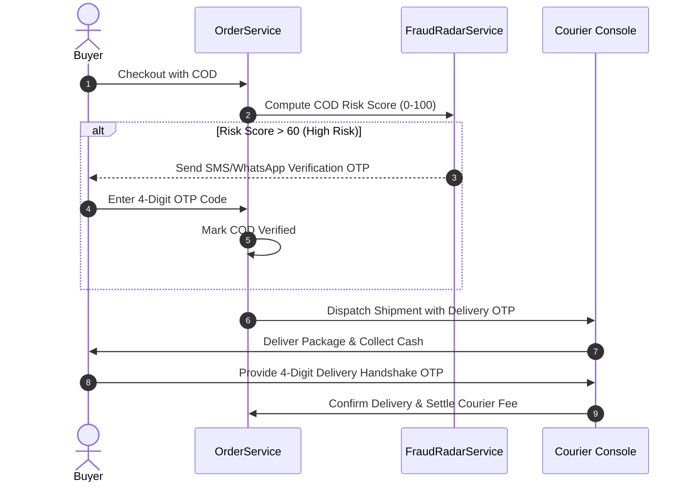

# 04 — Shipping Carriers & Cash on Delivery (COD) Verification

## 1. Shipping Carrier Architecture (`HttpCarrierAdapter`)

PandaMarket provides a unified carrier abstraction interface supporting local Tunisian logistics providers:

```
backend/src/services/carrier-adapter.ts
├── Aramex Tunisia (aramex)
├── La Poste Tunisienne / Rapid-Poste (laposte_rapid)
├── First Delivery (first_delivery)
├── Runex (runex)
├── Fleex (fleex)
└── Merchant Own Fleet / Self-Managed (own_fleet)
```

### Carrier Adapter Operations:
1. `getRates(request)`: Computes live shipping quote based on weight, governorate destination, and COD handling fee.
2. `createShipment(request)`: Generates automated Air Waybill (AWB) number and printable shipping label PDF URL.
3. `track(trackingNumber)`: Retrieves normalized tracking status events.
4. `verifyWebhook(rawBody, signature)`: Validates inbound status webhooks from logistics carriers.

---

## 2. Cash on Delivery (COD) Risk Radar & OTP Handshake



- **Courier Settlement Ledger (`pd_courier_settlement`):** Tracks cash collected by delivery drivers, courier deduction fees, and net payout settled to the vendor wallet.

---

## 3. Shipping & COD Checklist

- [x] Standardized carrier adapter interface (`HttpCarrierAdapter`).
- [x] COD order creation with risk scoring attributes.
- [x] Mobile courier delivery console with OTP handshake verification.
- [x] Courier cash settlement tracking table.
- [ ] Connect live production API endpoints for Rapid-Poste & Aramex.
