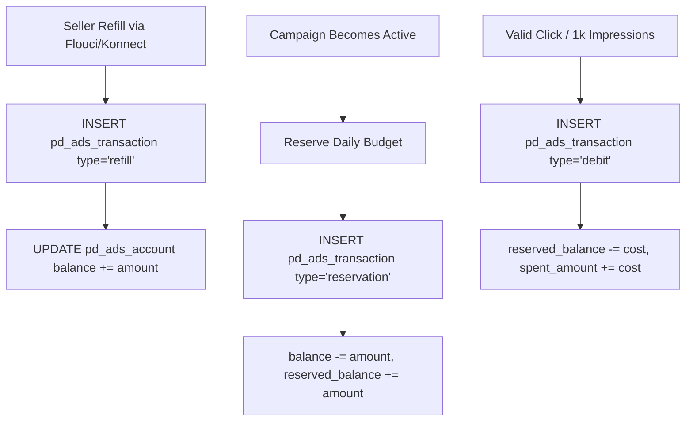

# 01 — PandaMarket Ads: Architecture & Immutable Ledger

## 1. Overview & Data Model

PandaMarket Ads is an integrated prepaid advertising network that allows verified merchants to promote listings, stores, and custom campaigns across the marketplace:

```
Database Entities (Migrations 025–029, 041–042):
├── pd_ads_account               # Store prepaid balance & reserved budget
├── pd_ads_transaction           # Immutable credit/debit transaction ledger
├── pd_ads_campaign              # Campaign configuration, targeting, pricing & status
├── pd_ads_creative              # Banner images, headlines, destination URLs
├── pd_ads_placement             # Delivery slot definitions, dimensions & pricing
├── pd_ads_campaign_placement    # Placement relation mappings
├── pd_ads_event                 # Granular impression and click events with fraud metadata
├── pd_ads_daily_stat            # Aggregated daily/hourly reporting stats
├── pd_ads_review                # Moderation audit trail
└── pd_ads_conversion            # Attributed orders & GMV revenue
```

---

## 2. Double-Entry Prepaid Ledger Mechanics (`AdsService`)

Ads funds remain strictly segregated from e-commerce seller revenue to prevent commingling:



### Ledger Invariants:
1. **No Overdrafts:** Clicks and impressions are instantly dropped if the campaign's reserved budget or account balance reaches `0.000 TND`.
2. **Atomicity:** All balance deductions and reservation releases execute in PostgreSQL transactions using `FOR UPDATE` locks.
3. **Idempotent Refills:** Every refill uses an `idempotency_key` preventing double crediting during network retries.

---

## 3. Ads Ledger Checklist

- [x] Dedicated Ads account and immutable transaction ledger.
- [x] Separation of Ads funds from seller e-commerce escrow wallet.
- [x] Atomic budget reservation per active campaign.
- [x] Idempotent payment refill integration via Flouci and Konnect.
- [ ] Add downloadable PDF tax invoices for Ads refill transactions.
