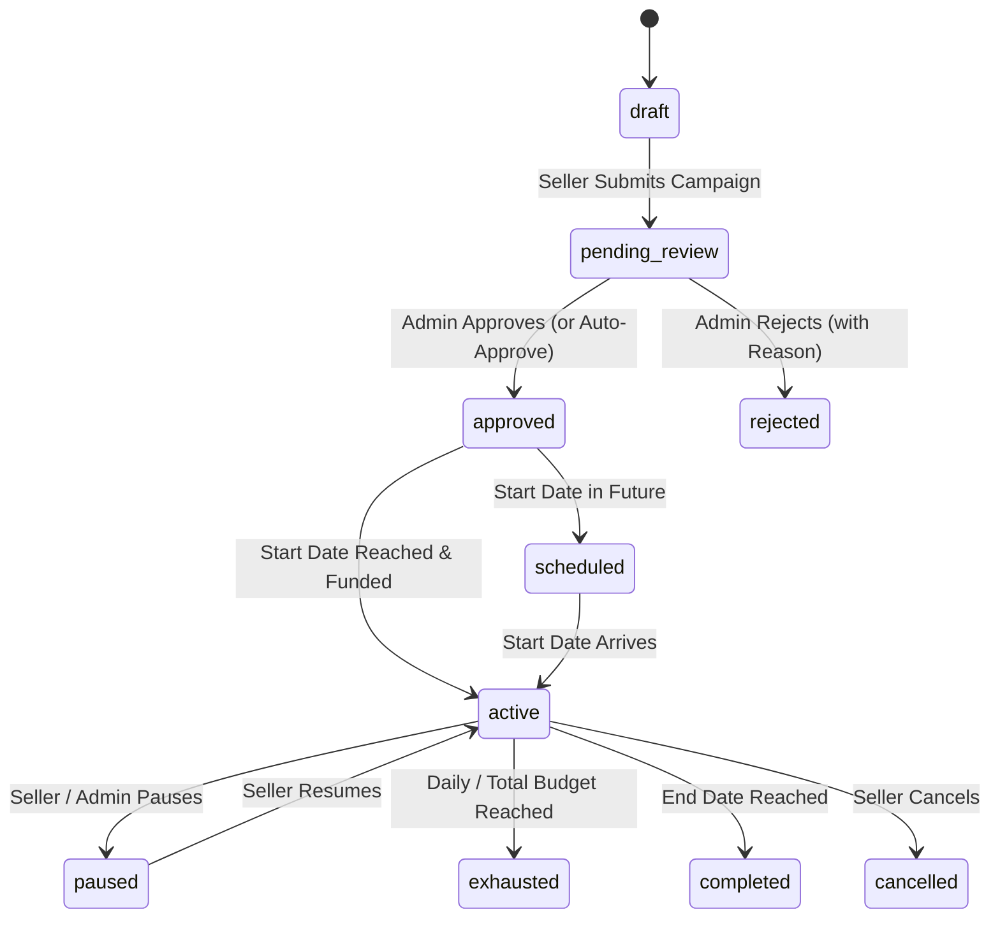

# 02 — Campaign Lifecycle, Pricing & Ad Delivery Engine

## 1. Campaign Lifecycle State Machine

Campaigns transition across a deterministic state machine:

---

## 2. Pricing Models & Placements

### 2.1 Pricing Models
1. **CPC (Cost Per Click):** Charged only upon a valid, verified human click on the ad creative.
2. **CPM (Cost Per Mille):** Charged per 1,000 viewable impressions.
3. **Fixed Daily Sponsorship:** Premium fixed rate for 24h exclusive placement in top hero slots.

### 2.2 Marketplace Placements
- `hub_home_hero`: 16:9 carousel banner on the homepage.
- `hub_sponsored_brand_rail`: Horizontal brand carousel on category and home pages.
- `hub_search_top_banner`: Top placement above organic search results.
- `hub_category_top_banner`: Top placement above category product grids.
- `hub_product_recommendations`: Sponsored similar product cards on product detail pages.

---

## 3. Bid-Weighted Ranking & Delivery Algorithm

When a placement slot requests ads (`GET /api/pd/ads/serve?placement=...`):
1. **Eligibility Filter:** Filters campaigns by `status = 'active'`, matching placement, valid date range, target locale (`fr`/`ar`/`en`), category match, and positive remaining balance.
2. **Ranking Score Calculation:**
   $$\text{Score} = \text{Bid Amount} \times \text{Relevance Weight} \times \text{Pacing Factor}$$
3. **Pacing Algorithm:** Smooths budget spending across the 24 hours of the day to prevent immediate exhaustion in the morning.

---

## 4. Ads Delivery Checklist

- [x] State machine transition validation on all campaign updates.
- [x] Bid-weighted delivery and category targeting algorithm.
- [x] Time-distributed daily budget pacing.
- [x] Responsive placement slot rendering across all Hub templates.
- [ ] Add frequency capping per unique browser session (max 3 impressions per campaign per hour).
