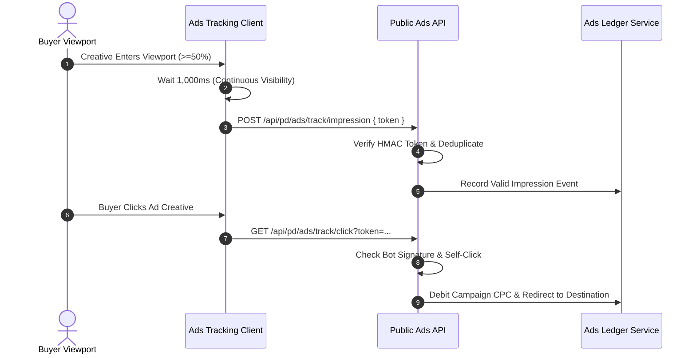

# 03 — Ads Tracking, Fraud Prevention & Conversion Attribution

## 1. Impression & Click Verification Standards

PandaMarket Ads adheres to the **IAB (Interactive Advertising Bureau) Standard**:
- **Viewable Impression:** An impression is recorded as billable ONLY when at least **50% of the creative pixels** remain visible in the buyer's viewport for at least **1 continuous second** (measured via `IntersectionObserver`).
- **Signed Event Tokens:** Ad impressions and clicks embed a cryptographically signed HMAC token containing `campaign_id`, `creative_id`, `placement_id`, and `expires_at` (15-minute validity).

---

## 2. Multi-Tier Fraud Prevention Controls

1. **Bot & Crawler Filtering:** Evaluates User-Agent headers, headless browser signatures, and honeypot interaction speeds (<50ms clicks are flagged as automated scripts).
2. **Duplicate Suppression:** Redis sliding window suppresses multiple clicks from the same IP/Session within a 5-minute cooldown window.
3. **Seller Self-Click Exclusion:** If an authenticated seller clicks their own ad creative, the click is registered for tracking purposes but **0.000 TND is debited**.
4. **Salted IP Hashing:** IP addresses are hashed with a daily rotating salt to protect user privacy while preserving anomaly detection capabilities.

---

## 3. Order Conversion Attribution Engine

- **Attribution Model:** **Last-Touch Attribution** with a **7-day click window** and **1-day view window**.
- **Conversion Capture:** When a buyer places an order and payment is captured, the checkout engine matches active attribution tokens in `localStorage` against `pd_ads_event`.
- **ROAS Calculation:** Automatically computes Return on Ad Spend:
  $$\text{ROAS} = \frac{\text{Attributed Order GMV (TND)}}{\text{Total Campaign Spend (TND)}}$$

---

## 4. Ads Tracking Checklist

- [x] 50%/1s IAB viewability measurement via `IntersectionObserver`.
- [x] Signed HMAC-SHA256 event tokens with 15-minute expiration.
- [x] Bot filtering and automated rapid-click suppression.
- [x] Seller self-click exclusion from billing.
- [x] 7-day click & 1-day view conversion attribution.
