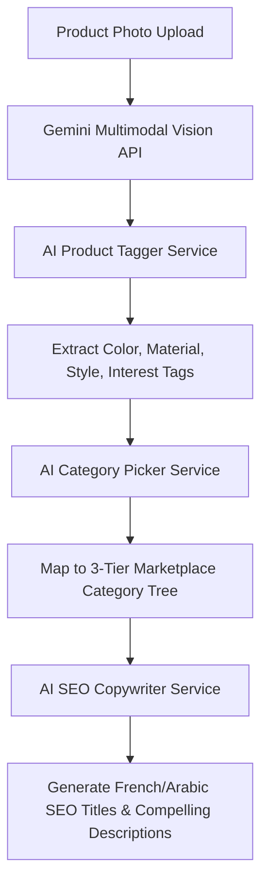

# 01 — Gemini AI Services, Prompts & Copywriting Engine

## 1. AI Capabilities & Multi-Provider Architecture

PandaMarket integrates **Google Gemini Pro / Flash** as its core generative engine, supported by a multi-provider fallback hierarchy (`AiConfigService`):

```
Supported AI Providers:
├── Google Gemini (Default — 1.5/2.0 Flash & Pro)
├── Anthropic Claude (claude-3-5-sonnet)
├── OpenAI (gpt-4o-mini, gpt-4o)
├── Replicate (FLUX.1 image models)
└── Custom OpenAI-Compatible Base URLs (DeepSeek, Groq, Ollama)
```

---

## 2. Core AI Services & Prompt Templates



### Prompt Engineering Configurations:
1. **AI SEO Copywriting (`ai-copywriter.service.ts`):** Produces conversion-optimized French and Arabic product descriptions with bullet points, target audience keywords, and meta tags.
2. **AI Multimodal Product Tagger (`ai-product-tagger.service.ts`):** Analyzes uploaded product images and extracts structured JSON containing primary color, secondary color, materials, gender, fit, and semantic search tags.
3. **AI Category Picker (`ai-category-picker.ts`):** Classifies complex multi-word product titles into the precise 3-tier marketplace taxonomy with >95% accuracy.

---

## 3. Gemini AI Checklist

- [x] Gemini API integration with Google Generative AI SDK.
- [x] Multi-tier provider fallback routing (Gemini ➔ OpenAI ➔ Claude).
- [x] Multilingual prompt generation in French and Arabic.
- [x] Structured JSON output parsing with Zod validation.
- [ ] Add Gemini background removal and photo lighting enhancement.
