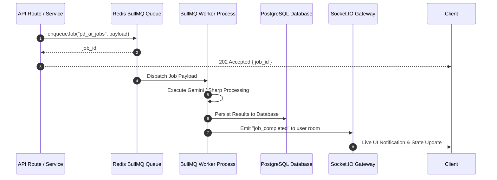

# 02 — BullMQ Worker Architecture & Queue Management

## 1. Queue Topology & Concurrency Settings

PandaMarket manages asynchronous background workloads through **Redis 7 + BullMQ 5.12+**:

| Queue Name | Primary Worker | Concurrency | Retry Strategy | Backoff Delay |
| :--- | :--- | :---: | :---: | :---: |
| `pd_ai_jobs` | `ai.worker.ts` | 5 | 3 Attempts | Exponential (2,000ms) |
| `pd_emails` | `email.worker.ts` | 10 | 5 Attempts | Exponential (1,000ms) |
| `pd_webhooks` | `webhook.worker.ts` | 10 | 5 Attempts | Exponential (3,000ms) |
| `pd_payouts` | `payout.worker.ts` | 1 | 2 Attempts | Fixed (10,000ms) |
| `pd_search` | `search.worker.ts` | 5 | 3 Attempts | Exponential (1,000ms) |
| `pd_subscriptions`| `subscription.worker.ts` | 2 | 3 Attempts | Exponential (5,000ms) |
| `pd_payment_reconciliation` | `payment-reconciliation.worker.ts` | 2 | 2 Attempts | Fixed (30,000ms) |
| `pd_shipment_reconciliation`| `shipment-reconciliation.worker.ts` | 2 | 2 Attempts | Fixed (30,000ms) |
| `pd_notification_batch` | `notification-batch.worker.ts` | 5 | 3 Attempts | Exponential (1,000ms) |

---

## 2. Job Execution Lifecycle

---

## 3. Worker Reliability Checklist

- [x] BullMQ queue definitions isolated in `backend/src/queues/`.
- [x] Error serialization and dead-letter queue persistence.
- [x] Graceful shutdown listeners on `SIGTERM` and `SIGINT`.
- [x] Real-time job completion broadcasting over Socket.IO.
- [ ] Add queue lag monitoring alert in Prometheus.
