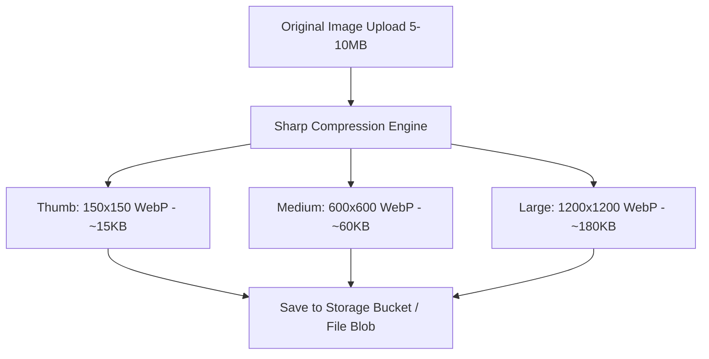

# 02 — Image Compression & Multi-Size Variant Pipeline

## 1. Image Processing Engine (`Sharp` + Node 20)

PandaMarket uses **Sharp 0.33+ (libvips)** to compress, resize, and convert uploaded product and store images into optimized WebP formats:

---

## 2. Dynamic On-The-Fly Variant Fallback

In [`backend/src/services/image-variant.service.ts`](file:///c:/tek/pandamarket/backend/src/services/image-variant.service.ts), if a requested size variant (e.g. `product_123_medium.webp`) does not exist on disk or in storage, the service:
1. Fetches the base master image from storage or PostgreSQL `pd_file_blobs`.
2. Generates the requested preset variant on-the-fly in `<50ms`.
3. Streams the response to the client while asynchronously saving the newly generated variant back to storage.

---

## 3. Image Security & Content Constraints

1. **Magic Bytes Validation:** Inspects image header buffers to ensure uploaded files are valid JPEG/PNG/WebP/SVG and not masked executables.
2. **SVG Sanitization:** All uploaded SVG vectors pass through DOMPurify sanitization to strip embedded `<script>` or event handlers.
3. **Dimension Limits:** Images exceeding $4000 \times 4000\text{ px}$ are automatically downscaled to prevent memory exhaustion (decompression bomb defense).

---

## 4. Image Pipeline Checklist

- [x] Sharp multi-size WebP compression presets (thumb, medium, large).
- [x] On-the-fly variant generation fallback middleware.
- [x] PostgreSQL blob persistence backup for ephemeral filesystem deploys.
- [x] Magic bytes header validation on all file uploads.
- [ ] Add automatic WebP/AVIF format negotiation via Accept header.
