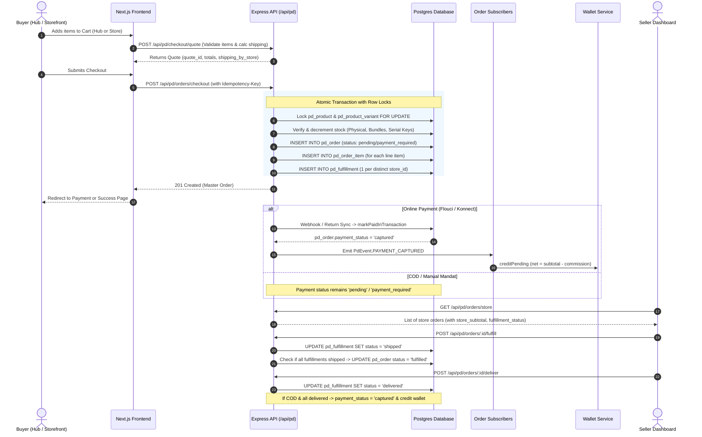

# 01 - Executive Summary & End-to-End Marketplace Order Architecture

## 1. High-Level Executive Summary

PandaMarket is a hybrid **Marketplace-as-a-Service (MaaS)** platform tailored for the Tunisian e-commerce ecosystem. It combines two core business architectures:
1. **Central Marketplace Hub (`pandamarket.tn`)**: An Amazon/Alibaba-style discovery marketplace where buyers can browse, cart, and checkout products from multiple vendors simultaneously.
2. **Dedicated Merchant Storefronts (`*.pandamarket.tn` / Custom Domains)**: A Shopify-style SaaS engine where each merchant operates an isolated, branded store with store-scoped cart, checkout, theme customizations, and Page Builder experiences.

### Key Architectural Tenets
- **Currency**: Tunisian Dinar (TND) formatted to 3 decimal places (`0.000 TND`). Konnect gateway operates in millimes (`1 TND = 1000 millimes`).
- **Payment Gateways**:
  - `flouci` (Automated bank card / app wallet with HMAC webhook signature verification)
  - `konnect` (Automated payment gateway with return URL polling & webhook reconciliation)
  - `manual_mandat` (Mandat Minute with proof upload `pd_mandat_proof` and manual review)
  - `cod` (Cash on Delivery with risk scoring, SMS OTP verification, and post-delivery settlement)
- **Multi-Vendor Order Splitting**:
  - 1 Customer Checkout $\rightarrow$ 1 Master Order (`pd_order`) $\rightarrow$ $N$ Line Items (`pd_order_item`) $\rightarrow$ $M$ Store Fulfillments (`pd_fulfillment`).
  - Each vendor only sees, fulfills, and manages the portion of the order that contains their items.

---

## 2. End-to-End Order Lifecycle Flow

---

## 3. Deep Component Breakdown

### 3.1 Cart Scoping & Isolation
- **Hub Cart (`/hub/cart`)**:
  - Allows items from multiple stores (`item.store_id`).
  - Shipping fee is aggregated across distinct vendors:
    $$\text{Total Shipping} = \sum_{s \in \text{Stores}} \text{shipping\_fee}(s)$$
- **Storefront Cart (`[storeHost]/cart`)**:
  - Strictly isolated to the store matching the host header.
  - Automatically filters global cart storage to only render items where `item.store_id === store.id`.

### 3.2 Quote Generation (`checkoutQuoteService.createQuote`)
- Implemented in `backend/src/services/checkout-quote.service.ts`.
- Validates active product status (`published`), store verification (`is_verified = true`), and stock availability.
- Evaluates coupon rules (minimum purchase, category restrictions, store specificity, maximum uses).
- Computes `quoteTotals`:
  - `gross_subtotal`
  - `discount_total`
  - `tax_total`
  - `shipping_total` (and per-store map `shipping_by_store`)
  - `total`
- Saves snapshot and assigns unique `quote_id` valid for a short TTL.

### 3.3 Atomic Order Creation (`orderService.checkout`)
- Implemented in `backend/src/services/order.service.ts` (lines 450-880).
- **Deadlock Prevention**: Sorts unique product IDs and variant IDs alphabetically before applying PostgreSQL `SELECT ... FOR UPDATE` locks.
- **Stock Decrements**:
  - *Physical Goods*: Decrements `pd_product.inventory_quantity` and `pd_product_variant.inventory_quantity`.
  - *Promo Packs (Bundles)*: Queries `pd_product_bundle_item` and atomically decrements each individual component product and variant.
  - *Digital Licenses (Serial Keys)*: Queries `pd_license_key` with `FOR UPDATE SKIP LOCKED` and binds keys to the new `order_id`.
- **Database Records Created**:
  - `pd_order`: Master record containing buyer ID, gross totals, discounts, shipping address JSONB, quote snapshot, and payment gateway.
  - `pd_order_item`: 1 record per cart line item, capturing `store_id`, `product_id`, `variant_id`, snapshot `title`, `unit_price`, and line discount.
  - `pd_fulfillment`: **1 record per unique `store_id`**. Initialized with `status = 'pending'`, `shipping_total = quoteTotals.shipping_by_store[store_id]`.

### 3.4 Payment Handling & Webhook Capture
- Implemented in `backend/src/services/payment.service.ts` and `backend/src/api/payment.route.ts`.
- **Idempotency**: Webhook payloads are hashed and registered in `pd_payment_event` to prevent double processing.
- **Transaction Processing**: Calls `orderService.markPaidInTransaction`:
  - Updates `pd_order.payment_status = 'captured'`.
  - Emits `PdEvent.PAYMENT_CAPTURED`.

### 3.5 Vendor Escrow & Wallet Crediting
- Implemented in `backend/src/subscribers/order.subscriber.ts` (lines 178-255) and `backend/src/services/wallet.service.ts`.
- For each store participating in the order:
  1. Determines vendor subscription plan (`pd_store.subscription_plan`).
  2. Resolves commission rate (Free: 15%, Starter+: 0%).
  3. Calculates vendor net share.
  4. Calls `walletService.creditPending` with gateway-specific retention days:
     - `retention_days_flouci` (default: 3 days)
     - `retention_days_konnect` (default: 3 days)
     - `retention_days_mandat` (default: 1 day)
     - `retention_days_cod` (default: 7 days)
  5. BullMQ payout worker releases pending balance to available balance once `available_at <= NOW()`.

### 3.6 Fulfillment Lifecycle & Multi-Vendor Isolation
- Implemented in `backend/src/services/order.service.ts` and `frontend/src/app/hub/dashboard/orders/page.tsx`.
- **Fulfillment States**:
  - `pending` $\rightarrow$ Order placed, waiting for merchant packing/shipping.
  - `shipped` $\rightarrow$ Merchant provided carrier and tracking number via `POST /api/pd/orders/:id/fulfill`.
  - `delivered` $\rightarrow$ Merchant or courier confirmed delivery via `POST /api/pd/orders/:id/deliver` (creates `pd_store_delivery_proof`).
  - `cancelled` $\rightarrow$ Merchant cancelled their portion via `POST /api/pd/orders/:id/fulfillment/cancel` (restocks inventory for that store only).
  - `rto` $\rightarrow$ Merchant marked as Return to Origin via `POST /api/pd/orders/store/:id/rto` (restocks inventory and records RTO reason).
