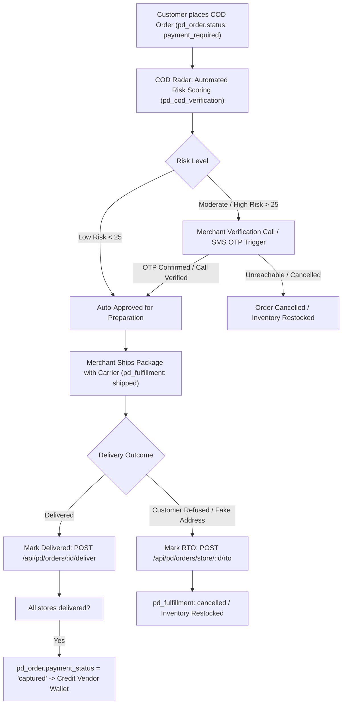

# 03 - Financial Escrow, Shipping & Settlement Deep Audit

This document audits the financial calculations, wallet escrow crediting, commission deductions, shipping fee disbursements, and carrier settlement mechanics across the PandaMarket platform.

---

## 💰 1. Platform Subscription Tiers & Commission Matrix

PandaMarket operates a tiered subscription model configured in `pd_subscription_limits`:

| Subscription Plan | Yearly Cost (TND) | Commission Rate | AI Tokens / Limits | Direct Payment |
|---|---|---|---|---|
| **Free** | 0 TND | **15.0%** | None | No (Escrow only) |
| **Starter** | 300 TND | **0.0%** | Basic | No |
| **Regular** | 600 TND | **0.0%** | Standard + Page Builder | No |
| **Agency** | 1,200 TND | **0.0%** | Advanced | No |
| **Pro** | 2,400 TND | **0.0%** | Unlimited AI | Yes (Direct Flouci/Konnect) |
| **Golden** | 4,800 TND | **0.0%** | High limits | Yes |
| **Platinum** | 9,600 TND | **0.0%** | White Label | Yes |

---

## ⚠️ 2. Critical Financial Finding: Shipping Fee Omission in Vendor Wallet Credit

### 2.1 The Issue
In [`backend/src/subscribers/order.subscriber.ts`](file:///c:/tek/pandamarket/backend/src/subscribers/order.subscriber.ts#L200-L236), during the `onPaymentCaptured` event handler:

```typescript
// Per-store totals (excluding shipping for commission calc — keep it simple here)
const { rows: storeRows } = await query<{
  store_id: string;
  owner_id: string;
  owner_email: string;
  plan: string;
  store_total: string;
}>(
  `SELECT i.store_id, s.owner_id, u.email AS owner_email,
          s.subscription_plan AS plan,
          SUM(i.subtotal)::text AS store_total
   FROM pd_order_item i
   JOIN pd_store s ON s.id = i.store_id
   JOIN pd_user u ON u.id = s.owner_id
   WHERE i.order_id = $1
   GROUP BY i.store_id, s.owner_id, u.email, s.subscription_plan`,
  [orderId],
);

for (const row of storeRows) {
  const total = parseFloat(row.store_total);
  const limits = await subscriptionService.getLimits(row.plan);
  const commission = calculateCommission(total, limits.commission_rate);
  const net = calculateVendorNet(total, limits.commission_rate);

  if (net > 0) {
    await walletService.creditPending({
      store_id: row.store_id,
      amount: net,
      order_id: orderId,
      retention_days: retentionDays,
      description: commission > 0
        ? `Sale (${total} TND) − commission (${commission} TND)`
        : `Sale (${total} TND)`,
    });
  }
}
```

### 2.2 Financial Impact
1. **Scenario**: A customer orders 100.000 TND of products from Vendor A (Free plan: 15% commission) with 7.000 TND shipping.
   - Total paid by customer: **107.000 TND**.
   - Subtotal of items: **100.000 TND**.
   - Platform Commission on items: $100 \times 15\% = \mathbf{15.000\text{ TND}}$.
   - Expected Vendor Net: $\text{Item Net (85.000)} + \text{Shipping (7.000)} = \mathbf{92.000\text{ TND}}$ (since the merchant pays the carrier).
   - **Actual Credited to Vendor Wallet**: $100 - 15 = \mathbf{85.000\text{ TND}}$.
2. **Result**: The **7.000 TND shipping fee remains in the marketplace account** and is never credited to the merchant wallet. If the merchant ships the order via their own carrier account (e.g. Aramex or La Poste), the merchant absorbs the shipping cost out of pocket!

### 2.3 Required Calculation Adjustment
$$\text{Vendor Credit} = \left(\text{store\_subtotal} - \text{commission}(\text{store\_subtotal})\right) + \text{store\_shipping\_total}$$
*(Where commission is charged only on item subtotal, and shipping fee collected from the buyer is passed 100% to the fulfilling merchant unless platform shipping labels are prepaid).*

---

## 📦 3. Cash on Delivery (COD) Financial Cycle

PandaMarket includes an advanced COD workflow specifically designed for high-risk cash logistics:



### 3.1 Courier Settlement Ledger (`pd_courier_settlement`)
- Allows vendors to record and reconcile cash collected by logistics providers:
  - `collected_amount`: Cash collected from customer.
  - `courier_fee`: Delivery charge deducted by carrier (e.g. 7.000 TND).
  - `net_payout`: Amount remitted to vendor (`collected_amount - courier_fee`).
  - Statuses: `pending`, `settled`, `disputed`.

---

## 🏦 4. Gateway Retention Periods & Payouts

In `backend/src/subscribers/order.subscriber.ts` and `backend/src/services/platform-config.service.ts`:

- **Flouci**: Default 3 days retention before release.
- **Konnect**: Default 3 days retention before release.
- **Manual Mandat**: Default 1 day retention (since cash receipt is verified before release).
- **COD**: Default 7 days retention (to buffer against potential buyer return/refund disputes).

When funds transition from `pending_balance` to `balance`, vendors on `PayoutMode.OnDemand` can request withdrawals via `POST /api/pd/wallet/withdraw`, which undergo Superadmin review.
