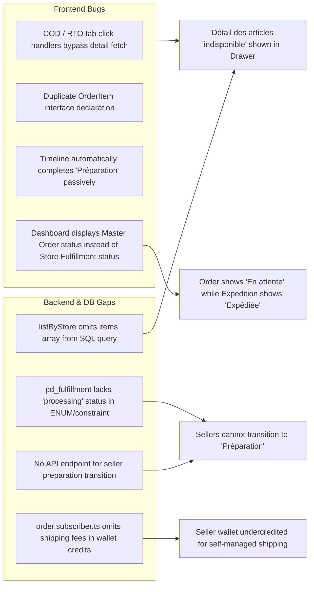

# PandaMarket Deep Audit: Marketplace Order Process & Seller Dashboard
**Audit Date**: August 30, 2026  
**Auditor**: Antigravity (Gemini 3.7 Flash)  
**Target Repository**: `https://github.com/prodypanda/pandamarket` (Production Environment)  
**Directory**: `gemini37flash antigravity 30082026/`

---

## 📌 Executive Overview

This directory contains the comprehensive, deep architectural and forensic audit of the **PandaMarket Order Management Ecosystem**, focusing on:
1. The **End-to-End Marketplace Order Lifecycle** (Hub & Storefront Carts, Quoting Engine, Atomic Stock Reservation, Multi-Vendor Order Splitting, Payment Capture, Wallet Escrow, and Fulfillment State Machines).
2. Forensic investigation and root cause analysis of critical Seller Dashboard bugs:
   - **Bug A**: Order status displaying `pending` ("En attente") even after fulfillment is marked `shipped` ("Expédiée").
   - **Bug B**: Complete inability for sellers to trigger or change the "Préparation" (Preparation/Processing) status.
   - **Bug C**: "Articles de la boutique" displaying "Détail des articles indisponible" across seller order views.
   - **Bug D**: Financial discrepancy where vendor shipping fees are omitted from wallet escrow credits during online payments.
3. Step-by-step **How-To Implementation Guides** with concrete code solutions, SQL migrations, API endpoint blueprints, and frontend component updates.
4. An actionable **Master TODO Checklist** for end-to-end remediation and verification.

---

## 📂 Documentation Directory Index

| Document | Description | Key Focus Areas |
|---|---|---|
| [**`01-executive-summary-and-architecture.md`**](./01-executive-summary-and-architecture.md) | Full architectural breakdown of the order process. | Multi-vendor cart scoping, quote calculations, atomic stock decrements, order splitting into `pd_fulfillment`, payment routing, and wallet crediting. |
| [**`02-root-cause-analysis-seller-dashboard-bugs.md`**](./02-root-cause-analysis-seller-dashboard-bugs.md) | Forensic root cause analysis of the reported seller dashboard bugs. | Exact file paths, line numbers, SQL queries, TypeScript interface collisions, and frontend state synchronization flaws. |
| [**`03-financial-escrow-and-shipping-audit.md`**](./03-financial-escrow-and-shipping-audit.md) | Financial, wallet escrow, and shipping logistics audit. | Platform commission calculations, wallet pending credit omissions (`SUM(i.subtotal)` vs `shipping_total`), COD reconciliation, and Mandat verification. |
| [**`04-step-by-step-remediation-how-to.md`**](./04-step-by-step-remediation-how-to.md) | Developer & AI agent How-To implementation guide. | Ready-to-apply code solutions: database migration for `processing`, backend route handlers, frontend fixes for drawer loading and secondary tabs. |
| [**`05-master-todo-checklist.md`**](./05-master-todo-checklist.md) | Granular phase-by-phase action checklist. | Backend, Database, Frontend Dashboard, Testing, and Deployment verification tasks. |

---

## 🔍 Key Findings Summary

---

## 🛡️ Operational & Security Protocols

As outlined in `REMOTE_CREDENTIALS.md`:
- **Safety First**: No source code files were modified during this audit phase.
- **Concurrent Agent Safety**: All target files must be re-read before applying future edits.
- **Git Protocol**: Any subsequent fix implementations must be committed and pushed to `github/main` with explicit user confirmation.
- **Deployment Alignment**: Render backend (`pandamarket-backend-fjom.onrender.com`) and Vercel frontend (`www.garbage.team`) deployment triggers.
