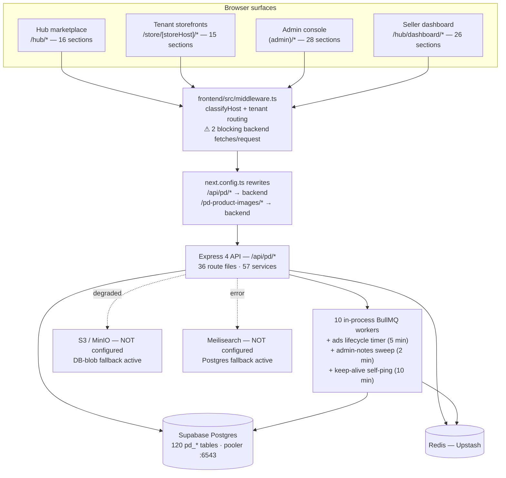
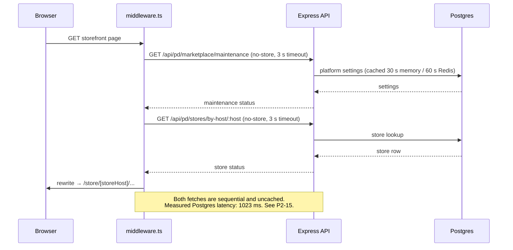
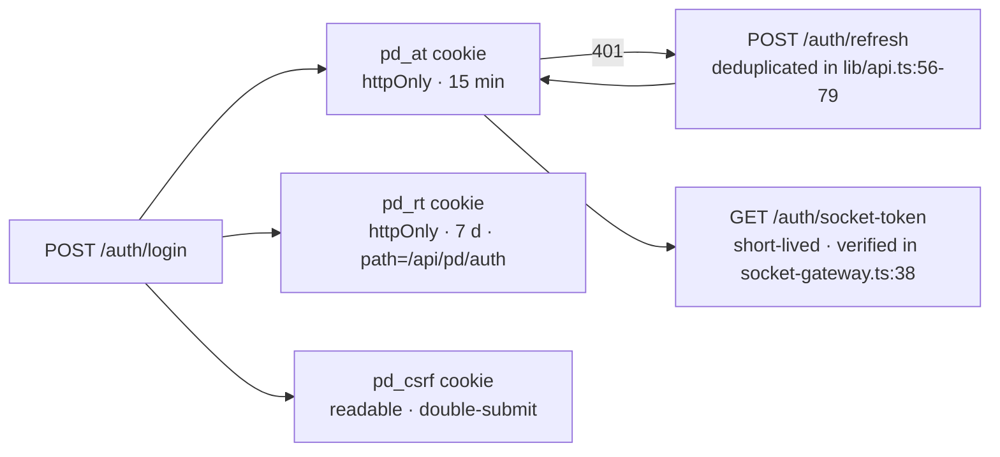
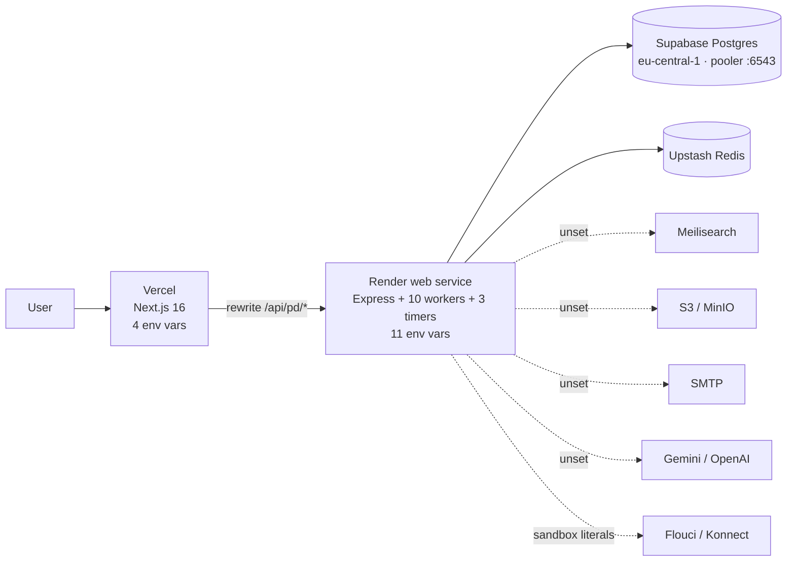

# 01 · Architecture Map

**Audit date:** 2026-08-24 · **Commit:** `898bca6` · [← Index](./README.md)

This document exists so that every finding in documents 02–07 can be read in context. It is a map of what exists,
not a judgement of it.

---

## System overview

---

## Stack

| Layer | Technology | Notes |
| --- | --- | --- |
| Frontend | Next.js **16.2.4**, React **19.2.4**, App Router | 390 `.ts`/`.tsx` files · 357 excluding tests |
| Frontend tests | Vitest + Testing Library | 44 files · 417 tests · all green |
| E2E | Playwright | `frontend/playwright-report/` exists locally; not in CI |
| Backend | Express 4, TypeScript | 36 route files · 57 services · 20 worker files |
| Queue | BullMQ on Redis | 10 workers started in-process |
| Database | Supabase Postgres via pooler `:6543` | 120 `pd_*` tables · 95 applied migrations |
| Cache / queue store | Upstash Redis | healthy (45 ms) |
| Search | Meilisearch | **not configured** (intentional) |
| Object storage | S3 / MinIO | **not configured** → R2 migration deferred |
| Frontend host | Vercel · `prj_f0I1YhUlcTCSY8MZ8KV4M6b5Ob3J` | 4 env vars |
| Backend host | Render · `srv-d9qjrth42hec73efhoa0` | 11 env vars |

> [!NOTE]
> `frontend/AGENTS.md` states plainly: *"This is NOT the Next.js you know."* Version 16 has breaking changes versus
> most training data. Any fix touching a route signature must be checked against `node_modules/next/dist/docs/`
> before writing code. [P1-4](./03-BUGS-P1-HIGH.md) is exactly the bug this warning was written to prevent.

---

## Request lifecycle

---

## Host classification

`frontend/src/middleware.ts` decides which of four surfaces a request belongs to, based on the `Host` header:

| Host pattern | Surface | Rewritten to |
| --- | --- | --- |
| `pandamarket.tn`, `www.pandamarket.tn`, `garbage.team`, `www.garbage.team` | Hub marketplace | `/hub/*` |
| `admin.*` | Admin console | `(admin)/*` |
| `.pandamarket.tn`, `.garbage.team` | Tenant storefront | `/store//*` |
| Custom domain mapped in `pd_store_domain` | Tenant storefront | `/store/<host>/*` |
| `localhost:*` | Any (dev) | per `?host=` override |

Dead constants left in this file (`HUB_DOMAINS`, `ADMIN_DOMAINS`, `PLATFORM_BASES`, `isAdminHost`,
`isMarketplaceHost`) are flagged in [P2-23](./04-BUGS-P2-MEDIUM.md).

---

## Frontend route inventory

### Hub marketplace — `frontend/src/app/hub/`

| Route | Purpose | Status |
| --- | --- | --- |
| `/hub` | Marketplace home | ✅ |
| `/hub/search` | Search results | ✅ Postgres path |
| `/hub/category/[slug]` | Category browse | ✅ |
| `/hub/products/[id]` | Product detail | ✅ |
| `/hub/products` | Product index | ❌ **404 — route does not exist** ([M10](./06-MISSING-WORK.md)) |
| `/hub/cart` · `/hub/checkout` | Cart and checkout | ✅ |
| `/hub/orders` · `/hub/account` · `/hub/profile` | Buyer account | ✅ |
| `/hub/wishlist` · `/hub/my-followed-feed` | Buyer engagement | ✅ |
| `/hub/messages` · `/hub/cases` | Messaging and disputes | ✅ |
| `/hub/pricing` · `/hub/vendor-signup` | Seller acquisition | ✅ |
| `/hub/pages/[slug]` | Platform CMS pages | ❌ **404 in production** ([P1-3](./03-BUGS-P1-HIGH.md)) |
| `/hub/dashboard/*` | Seller dashboard (26 sections) | ✅ |

### Tenant storefront — `frontend/src/app/store/[storeHost]/`

`/` · `/products` · `/product/[slug]` · `/cart` · `/checkout` · `/account` · `/login` · `/register` ·
`/forgot-password` · `/reset-password` · `/verify-email` · `/pages/[slug]` · `/preview` · `/maintenance` ·
`/robots.txt` · `/sitemap.xml`

The storefront `pages/[slug]` route renders through `SafePageRenderer` (DOMPurify). The hub equivalent does not —
that asymmetry is [P1-5](./03-BUGS-P1-HIGH.md).

### Seller dashboard — `frontend/src/app/hub/dashboard/` (26 sections)

`ads` · `ai` · `analytics` · `api-keys` · `categories` · `create-store` · `financial` · `kyc` · `loyalty` ·
`media` · `messages` · `my-subscription-orders` · `notifications` · `onboarding` · `online-store` · `orders` ·
`page-builder` · `payment-config` · `products` · `reports` · `select-store` · `settings` · `subscription` ·
`support` · `wallet` · `webhooks`

`hub/dashboard/products/page.tsx` is **>6,900 lines** in a single client component ([E22](./07-ENHANCEMENTS.md)).

### Admin console — `frontend/src/app/(admin)/` (28 sections)

`admin` · `admin-notes` · `ads` · `ai-costs` · `audit-log` · `buyer-audit-log` · `buyers` · `cms` · `dashboard` ·
`fraud-radar` · `kyc` · `mandats` · `marketplace-categories` · `messages` · `plans` · `platform-analytics` ·
`platform-media` · `products` · `reports` · `seller-audit-log` · `settings` · `smtp-config` · `stores` ·
`subscription-orders` · `system-logs` · `users` · `vendors` · `withdrawals`

`(admin)/cms` is non-functional end to end — see [P1-6](./03-BUGS-P1-HIGH.md) and
[P1-9](./03-BUGS-P1-HIGH.md).

### Dead frontend routes

| Path | Size | Note |
| --- | --- | --- |
| `frontend/src/app/dashboard/loyalty/page.tsx` | 420 B | `redirect()` stub → `/hub/dashboard/loyalty` |
| `frontend/src/app/dashboard/subscribers/page.tsx` | 424 B | `redirect()` stub → `/hub/dashboard/subscribers` |

Acceptable as compatibility shims; undocumented as such.

---

## Backend route inventory

36 files in `backend/src/api/`. Sorted by size, because size correlates with where risk hides:

| File | Size | Notes |
| --- | --- | --- |
| [`admin.route.ts`](file:///c:/tek/pandamarket/backend/src/api/admin.route.ts) | 243 KB | 6,882 lines · **225 routes** · `router.use(requireAuth, requireAdmin)` at line 66 |
| [`ai.route.ts`](file:///c:/tek/pandamarket/backend/src/api/ai.route.ts) | 80 KB | entirely inert — no AI key configured |
| [`store.route.ts`](file:///c:/tek/pandamarket/backend/src/api/store.route.ts) | 57 KB | |
| [`product.route.ts`](file:///c:/tek/pandamarket/backend/src/api/product.route.ts) | 21 KB | |
| [`files.route.ts`](file:///c:/tek/pandamarket/backend/src/api/files.route.ts) | 21 KB | |
| [`auth.route.ts`](file:///c:/tek/pandamarket/backend/src/api/auth.route.ts) | 20 KB | |
| [`order.route.ts`](file:///c:/tek/pandamarket/backend/src/api/order.route.ts) | 18 KB | |
| [`payment.route.ts`](file:///c:/tek/pandamarket/backend/src/api/payment.route.ts) | 18 KB | HMAC-verified webhooks ✅ |
| [`analytics.route.ts`](file:///c:/tek/pandamarket/backend/src/api/analytics.route.ts) | 17 KB | |
| [`ads.route.ts`](file:///c:/tek/pandamarket/backend/src/api/ads.route.ts) | 14 KB | |
| [`vendor.route.ts`](file:///c:/tek/pandamarket/backend/src/api/vendor.route.ts) | 11 KB | |
| [`storefront-account.route.ts`](file:///c:/tek/pandamarket/backend/src/api/storefront-account.route.ts) | 10 KB | |
| [`subscription.route.ts`](file:///c:/tek/pandamarket/backend/src/api/subscription.route.ts) | 10 KB | |
| [`chat.route.ts`](file:///c:/tek/pandamarket/backend/src/api/chat.route.ts) | 10 KB | |
| [`review.route.ts`](file:///c:/tek/pandamarket/backend/src/api/review.route.ts) | 9 KB | |
| [`shipping.route.ts`](file:///c:/tek/pandamarket/backend/src/api/shipping.route.ts) | 8 KB | per-carrier HMAC ✅ |
| [`marketplace.route.ts`](file:///c:/tek/pandamarket/backend/src/api/marketplace.route.ts) | 8 KB | |
| [`page-builder.route.ts`](file:///c:/tek/pandamarket/backend/src/api/page-builder.route.ts) | 8 KB | **has versions + restore + preview** ✅ |
| [`support.route.ts`](file:///c:/tek/pandamarket/backend/src/api/support.route.ts) | 7 KB | |
| [`storefront-auth.route.ts`](file:///c:/tek/pandamarket/backend/src/api/storefront-auth.route.ts) | 6 KB | |
| [`cart.route.ts`](file:///c:/tek/pandamarket/backend/src/api/cart.route.ts) | 6 KB | **both P0s live here** |
| [`wishlist.route.ts`](file:///c:/tek/pandamarket/backend/src/api/wishlist.route.ts) | 6 KB | |
| [`notification.route.ts`](file:///c:/tek/pandamarket/backend/src/api/notification.route.ts) | 6 KB | |
| [`search.route.ts`](file:///c:/tek/pandamarket/backend/src/api/search.route.ts) | 6 KB | uses `productService.searchPublished`, not `searchService` |
| [`seller.route.ts`](file:///c:/tek/pandamarket/backend/src/api/seller.route.ts) | 6 KB | |
| [`buyer.route.ts`](file:///c:/tek/pandamarket/backend/src/api/buyer.route.ts) | 5 KB | |
| [`categories.route.ts`](file:///c:/tek/pandamarket/backend/src/api/categories.route.ts) | 4 KB | |
| [`report.route.ts`](file:///c:/tek/pandamarket/backend/src/api/report.route.ts) | 3 KB | |
| [`platform-cms.route.ts`](file:///c:/tek/pandamarket/backend/src/api/platform-cms.route.ts) | **3 KB** | 7 endpoints; **3 more are called by the frontend and missing** |
| [`verification.route.ts`](file:///c:/tek/pandamarket/backend/src/api/verification.route.ts) | 3 KB | |
| [`email-template.route.ts`](file:///c:/tek/pandamarket/backend/src/api/email-template.route.ts) | 2 KB | |
| [`wallet.route.ts`](file:///c:/tek/pandamarket/backend/src/api/wallet.route.ts) | 2 KB | |
| [`address.route.ts`](file:///c:/tek/pandamarket/backend/src/api/address.route.ts) | 2 KB | |
| [`internal.route.ts`](file:///c:/tek/pandamarket/backend/src/api/internal.route.ts) | 2 KB | |
| [`theme.route.ts`](file:///c:/tek/pandamarket/backend/src/api/theme.route.ts) | 2 KB | |
| [`credits.route.ts`](file:///c:/tek/pandamarket/backend/src/api/credits.route.ts) | 2 KB | |

### The Platform CMS asymmetry, precisely

This table is the single most useful thing in this document, because five separate findings derive from it:

| Capability | Store page builder | Platform CMS |
| --- | --- | --- |
| List / get / create / update / delete | ✅ | ✅ |
| `GET .../versions` | ✅ `page-builder.route.ts:170` | ❌ missing |
| `POST .../versions/:id/restore` | ✅ `page-builder.route.ts:187` | ❌ missing |
| `POST .../preview` | ✅ `page-builder.route.ts:204` | ❌ missing |
| Version table | ✅ `pd_store_page_version` (migration 028) | ❌ does not exist |
| Server-side HTML/CSS sanitization | ✅ `sanitizeHtml` / `sanitizeCss` | ❌ stored verbatim |
| Client-side sanitized render | ✅ `SafePageRenderer` (DOMPurify) | ❌ raw `dangerouslySetInnerHTML` |
| ID convention | `pd_page_*` nanoid | ❌ `uuidv4()` |
| Editor component | `PageBuilderEditor.tsx` 4,325 lines | `PlatformPageBuilderEditor.tsx` 4,325 lines — **99.3% identical** |

The editor was forked. The backend was not. Everything else follows from that.

---

## Workers

`backend/src/workers/` contains 20 files. `main.ts:498` starts workers when `config.runWorkersInProcess` is true —
which is the default, and is not overridden on Render.

| Worker | Started at boot? | Standalone runner? |
| --- | --- | --- |
| `ai.worker.ts` | ✅ `main.ts:502` | ✅ `ai-runner.ts` |
| `email.worker.ts` | ✅ `main.ts:503` | ✅ `email-runner.ts` |
| `payout.worker.ts` | ✅ `main.ts:504` | ✅ `payout-runner.ts` |
| `search.worker.ts` | ✅ `main.ts:505` | ✅ `search-runner.ts` |
| `subscription.worker.ts` | ✅ `main.ts:506` | ✅ `subscription-runner.ts` |
| `webhook.worker.ts` | ✅ `main.ts:507` | ✅ `webhook-runner.ts` |
| `notification-batch.worker.ts` | ✅ `main.ts:508` | — |
| `daily-digest.worker.ts` | ✅ `main.ts:509` | — |
| `payment-reconciliation.worker.ts` | ✅ `main.ts:510` | ✅ runner |
| `shipment-reconciliation.worker.ts` | ✅ `main.ts:511` | ✅ runner |
| **`outbox.worker.ts`** | ❌ **never** | ❌ | 
| **`ai-tagger.worker.ts`** | ❌ **never** | ❌ |

Plus three timers in the same process: ads lifecycle (5 min), admin-notes reminder sweep (2 min), keep-alive
self-ping (10 min) at `main.ts:416-433`. See [P2-17](./04-BUGS-P2-MEDIUM.md).

---

## Data layer

| Metric | Value |
| --- | --- |
| `pd_*` tables | **120** |
| Applied migrations (`pd_migrations`) | **95** |
| Migration files | 120 (95 up + 25 `.down.sql`) |
| Latest migration | `083_shipping_integrations_and_cod.sql` |
| Duplicated numeric prefixes | **12** ([P1-12](./03-BUGS-P1-HIGH.md)) |
| Tables without a primary key | **0** ✅ |
| Tables with RLS enabled | **0 / 120** ([P2-20](./04-BUGS-P2-MEDIUM.md)) |
| Unindexed foreign keys | **69** ([P2-19](./04-BUGS-P2-MEDIUM.md)) |
| Measured Postgres latency from Render | **1023 ms** |

### Live row counts

| Table | Rows |
| --- | --- |
| `pd_user` | 13 |
| `pd_store` | 7 |
| `pd_product` | 132 |
| `pd_order` | 15 |
| `pd_platform_page` | **0** |
| `pd_gamified_lead` | 11 (all with `store_id = null`) |
| `pd_outbox_event` | 0 |

---

## Authentication and authorization model

Guard middleware in use: `requireAuth` · `requireAdmin` · `requireVendor` · `requireStore` · `optionalAuth` ·
`requireStorefrontCustomer`.

The gap: `GET /cart/gamified-leads` uses `requireAuth` **only**, with no role check — which is
[P0-2](./02-BUGS-P0-CRITICAL.md).

---

## Deployment topology

Nine of the dotted lines in that diagram are what [P1-10](./03-BUGS-P1-HIGH.md) is about.
