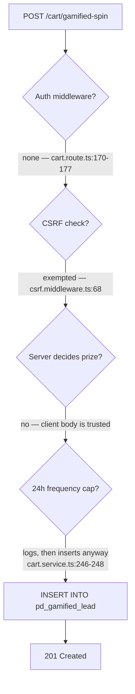
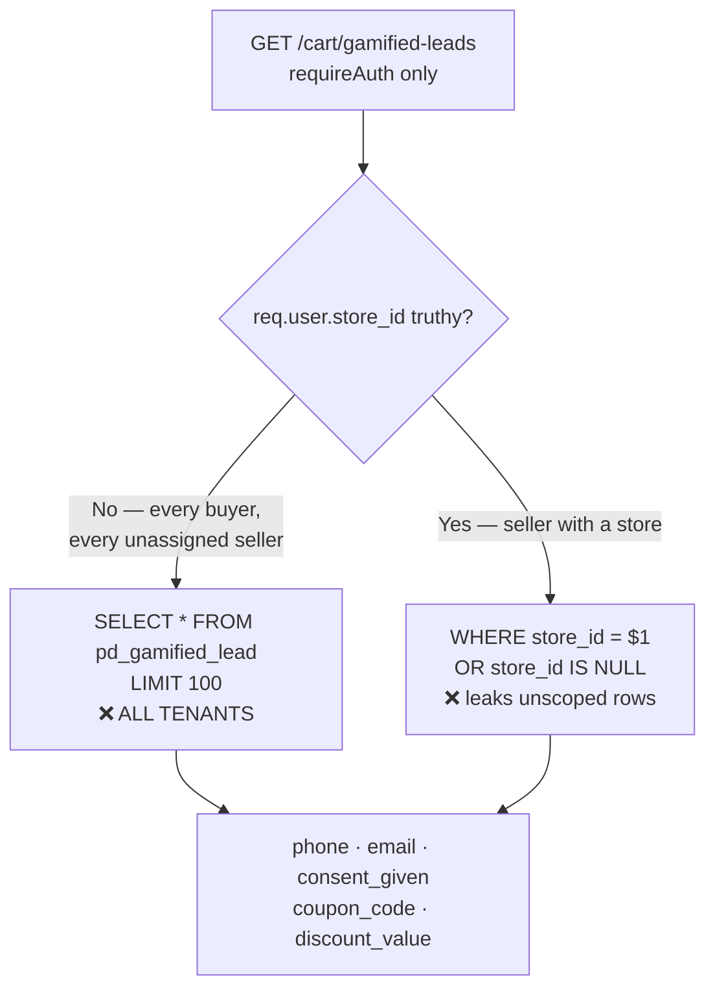

# 02 · P0 — Critical Bugs

**Audit date:** 2026-08-24 · **Commit:** `898bca6` · [← Index](./README.md)

Two findings. Both live in the same 192-line file: [`backend/src/api/cart.route.ts`](file:///c:/tek/pandamarket/backend/src/api/cart.route.ts).
One was reproduced against the live deployment. The other requires only a logged-in buyer account.

> [!CAUTION]
> Before reading further: proving P0-1 wrote a real row to the live database. Delete it.
> ```sql
> DELETE FROM pd_gamified_lead WHERE id = 'pd_lead_hsYAEUKxrxyqpnhU';
> ```

---

## P0-1 · Unauthenticated arbitrary coupon issuance via `/cart/gamified-spin`

| | |
| --- | --- |
| **Severity** | P0 — confirmed exploitable against the live deployment |
| **Type** | Broken authorization + client-controlled server state |
| **Reachability** | Public internet. No account, no session, no CSRF token. |
| **Current blast radius** | Junk rows + unsolicited PII capture. **Not** yet financial loss. |
| **Future blast radius** | Direct, unbounded financial loss the moment gamified leads are wired into redemption |
| **Effort to fix properly** | Medium (~half a day incl. a prize-config table) |
| **Effort to stop the bleeding** | ⚡ Under an hour |

### Reproduction (verified 2026-08-24)

```http
POST https://pandamarket-backend-fjom.onrender.com/api/pd/cart/gamified-spin
Content-Type: application/json

{
  "game_type": "spin_wheel",
  "prize_won": "AUDIT_PROBE_50_PERCENT",
  "coupon_code": "AUDITPROBE1",
  "discount_value": 99999,
  "consent_given": true
}
```

Response:

```json
HTTP/1.1 201 Created
{
  "data": {
    "success": true,
    "lead_id": "pd_lead_hsYAEUKxrxyqpnhU",
    "coupon_code": "AUDITPROBE1",
    "prize_won": "AUDIT_PROBE_50_PERCENT",
    "discount_value": 99999
  }
}
```

Confirmed in the database afterwards:

```
id                        = pd_lead_hsYAEUKxrxyqpnhU
coupon_code               = AUDITPROBE1
discount_value            = 99999.000
store_id                  = null
```

No `Authorization` header. No `Cookie` header. No `X-CSRF-Token`. A single unauthenticated HTTP request decided its
own prize and its own discount amount.

### Why it works — four independent failures, stacked



#### Failure 1 — no auth middleware, no dedicated limiter

[`cart.route.ts:170-177`](file:///c:/tek/pandamarket/backend/src/api/cart.route.ts#L170-L177):

```ts
router.post(
  '/gamified-spin',
  validate(gamifiedLeadSchema),
  asyncHandler(async (req, res) => {
    const result = await cartService.recordGamifiedLead(req.body);
    res.status(201).json({ data: result });
  }),
);
```

Compare the two routes directly above it in the same file: `/cart/quote` has `requireAuth`,
`/cart/storefront/quote` has `requireStorefrontCustomer`. `/cart/gamified-spin` has neither — not even
`optionalAuth`, which `/cart` and `/cart/sync` use. The only limit is the global `apiRateLimit` at 100 req/min,
which is a throughput limit, not an abuse control.

#### Failure 2 — explicitly exempted from CSRF

[`csrf.middleware.ts:61-72`](file:///c:/tek/pandamarket/backend/src/middlewares/csrf.middleware.ts#L61-L72):

```ts
if (
  req.path.includes('/webhook/') ||
  req.path.includes('/callback') ||
  req.path.includes('/shipping/smart-quotes') ||
  req.path.includes('/shipping/rates') ||
  req.path.includes('/shipping/webhooks/') ||
  req.path.includes('/cart/sync') ||
  req.path.includes('/cart/gamified-spin') ||   // ← here
  req.path.includes('/upload-s3-mock/')
) {
  return next();
}
```

Every other entry in that list has a stated justification: webhooks use HMAC, `/upload-s3-mock/` uses URL signature
tokens. `/cart/gamified-spin` has none. It is called from your own storefront JavaScript, which already has
`fetchWithCsrf` available.

#### Failure 3 — the client decides its own prize

[`cart.route.ts:81-91`](file:///c:/tek/pandamarket/backend/src/api/cart.route.ts#L81-L91):

```ts
const gamifiedLeadSchema = z.object({
  store_id: z.string().optional(),
  phone: z.string().optional(),
  email: z.string().email().optional(),
  consent_given: z.boolean().default(true),
  game_type: z.enum(['spin_wheel', 'scratch_card']),
  prize_won: z.string(),                                 // ← any string
  coupon_code: z.string(),                               // ← any string
  discount_value: z.number().nonnegative().default(0),   // ← any non-negative number
  device_fingerprint: z.string().optional(),
});
```

The schema validates **shape**, not **authority**. `discount_value: z.number().nonnegative()` accepts `99999`. It
would accept `Number.MAX_SAFE_INTEGER`. There is no `.max()`, and more importantly there should be no
`discount_value` field on the input at all — the server should be drawing the prize.

This is the core defect. The other three are what let an attacker reach it.

#### Failure 4 — the frequency cap does not cap anything

[`cart.service.ts:239-267`](file:///c:/tek/pandamarket/backend/src/services/cart.service.ts#L239-L267):

```ts
// Check frequency cap (1 entry per phone/device per 24 hours)
if (params.phone) {
  const { rows } = await query<{ count: string }>(
    `SELECT COUNT(*) as count FROM pd_gamified_lead
     WHERE phone = $1 AND created_at > NOW() - INTERVAL '24 hours'`,
    [params.phone],
  );
  if (parseInt(rows[0]?.count || '0', 10) > 0) {
    logger.info({ phone: params.phone }, 'Gamified reward rate limited for phone');
  }
}

await query(`INSERT INTO pd_gamified_lead ...`);   // ← runs unconditionally
```

There is no `return` and no `throw`. It logs "rate limited" and then inserts. Two further problems in the same
block: the check is skipped entirely when `phone` is absent (and `phone` is `.optional()`), and
`device_fingerprint` is accepted but never used for the cap the comment claims to implement.

### Why it is not yet catastrophic

The checkout coupon resolver never reads `pd_gamified_lead`.
[`checkout-quote.service.ts:481-536`](file:///c:/tek/pandamarket/backend/src/services/checkout-quote.service.ts#L481-L536)
matches five hardcoded literals and then falls back to `pd_seller_broadcast`:

```ts
if (couponCode === 'CHANCE5DT') { ... }
else if (couponCode === 'LIVRAISON_ZERO') { ... }
else if (couponCode === 'PANDA10') { ... }
else if (couponCode === 'SUPER15') { ... }
else if (couponCode === 'FIDELITE5') { ... }
else if (couponCode && storeIds.length > 0) {
  // SELECT ... FROM pd_seller_broadcast WHERE UPPER(coupon_code) = $1 ...
}
```

`AUDITPROBE1` matches nothing, so it is not redeemable. **This is luck, not design.** The gamified spin feature's
entire purpose is to hand out redeemable coupons. Whoever implements redemption will reasonably read from
`pd_gamified_lead` — and at that moment an unauthenticated attacker can mint a 99,999 TND discount.

Also note what is exploitable *today*, without redemption: unbounded rows in a live table, unbounded unsolicited
PII capture (`phone`, `email` with `consent_given` defaulting to `true`), and pollution of every seller's lead list
via [P0-2](#p0-2--cross-tenant-pii-leak-in-get-cartgamified-leads).

### How to fix

Four steps. Steps 1–2 stop the bleeding in under an hour; steps 3–4 are the real fix.

#### Step 1 ⚡ — make the cap actually block, and cover the no-phone case

In [`cart.service.ts`](file:///c:/tek/pandamarket/backend/src/services/cart.service.ts#L236-L250), replace the
frequency-cap block:

```diff
 async recordGamifiedLead(params: GamifiedLeadParams) {
   const id = pdId('lead');

-  // Check frequency cap (1 entry per phone/device per 24 hours)
-  if (params.phone) {
-    const { rows } = await query<{ count: string }>(
-      `SELECT COUNT(*) as count FROM pd_gamified_lead
-       WHERE phone = $1 AND created_at > NOW() - INTERVAL '24 hours'`,
-      [params.phone],
-    );
-    if (parseInt(rows[0]?.count || '0', 10) > 0) {
-      logger.info({ phone: params.phone }, 'Gamified reward rate limited for phone');
-    }
-  }
+  // Frequency cap: one entry per phone OR per device fingerprint per 24 hours.
+  // Enforced, not merely logged — see audit P0-1.
+  const identifiers: Array<{ column: 'phone' | 'device_fingerprint'; value: string }> = [];
+  if (params.phone) identifiers.push({ column: 'phone', value: params.phone });
+  if (params.device_fingerprint) {
+    identifiers.push({ column: 'device_fingerprint', value: params.device_fingerprint });
+  }
+
+  for (const { column, value } of identifiers) {
+    const { rows } = await query<{ count: string }>(
+      `SELECT COUNT(*)::int AS count FROM pd_gamified_lead
+        WHERE ${column === 'phone' ? 'phone' : 'device_fingerprint'} = $1
+          AND created_at > NOW() - INTERVAL '24 hours'`,
+      [value],
+    );
+    if (parseInt(rows[0]?.count || '0', 10) > 0) {
+      logger.info({ column }, 'Gamified reward rate limited');
+      throw new PdValidationError('Reward already claimed in the last 24 hours.');
+    }
+  }
```

The ternary is deliberate: it keeps the identifier a compile-time literal rather than an interpolated string, so
this does not repeat the pattern criticised in [P1-7](./03-BUGS-P1-HIGH.md).

Add the import if it is not already present:

```ts
import { PdValidationError } from '../errors';
```

#### Step 2 ⚡ — remove the CSRF exemption and add a dedicated limiter

In [`csrf.middleware.ts`](file:///c:/tek/pandamarket/backend/src/middlewares/csrf.middleware.ts#L61-L72):

```diff
     req.path.includes('/cart/sync') ||
-    req.path.includes('/cart/gamified-spin') ||
     req.path.includes('/upload-s3-mock/')
```

In [`middlewares/index.ts`](file:///c:/tek/pandamarket/backend/src/middlewares/index.ts#L333-L344), next to the
other limiters:

```ts
/**
 * Abuse control for the gamified retention endpoint (P0-1).
 * Deliberately tighter than apiRateLimit: this endpoint mints coupon rows.
 */
export const gamifiedSpinRateLimit = rateLimit({
  windowMs: 60 * 60 * 1000,
  max: 5,
  standardHeaders: true,
  legacyHeaders: false,
  keyGenerator: (req) => req.ip ?? 'unknown',
  message: { error: { code: PdErrorCode.RATE_LIMITED, message: 'Too many reward attempts' } },
});
```

Then in [`cart.route.ts`](file:///c:/tek/pandamarket/backend/src/api/cart.route.ts#L170-L177):

```diff
 router.post(
   '/gamified-spin',
+  gamifiedSpinRateLimit,
+  optionalAuth,
   validate(gamifiedLeadSchema),
```

> [!IMPORTANT]
> Do this limiter with a Redis store, not the default in-memory one — see
> [P2-22](./04-BUGS-P2-MEDIUM.md). An in-memory 5/hour limit resets on every Render deploy and multiplies by
> instance count.

#### Step 3 — make the server authoritative about the prize

This is the actual fix. The client must stop sending `prize_won`, `coupon_code`, and `discount_value`.

**3a. Add a prize-configuration table.** New migration — use a timestamp prefix per
[P1-12](./03-BUGS-P1-HIGH.md), e.g. `20260824T2100_gamified_prize_config.sql`:

```sql
CREATE TABLE IF NOT EXISTS pd_gamified_prize (
  id               VARCHAR(64) PRIMARY KEY,
  store_id         VARCHAR(64) REFERENCES pd_store(id) ON DELETE CASCADE,
  game_type        VARCHAR(32) NOT NULL CHECK (game_type IN ('spin_wheel', 'scratch_card')),
  label            VARCHAR(120) NOT NULL,
  discount_type    VARCHAR(16)  NOT NULL CHECK (discount_type IN ('percentage', 'fixed', 'free_shipping', 'none')),
  discount_value   NUMERIC(10,3) NOT NULL DEFAULT 0 CHECK (discount_value >= 0 AND discount_value <= 1000),
  weight           INTEGER      NOT NULL DEFAULT 1 CHECK (weight >= 0),
  is_active        BOOLEAN      NOT NULL DEFAULT true,
  created_at       TIMESTAMP    NOT NULL DEFAULT NOW(),
  updated_at       TIMESTAMP    NOT NULL DEFAULT NOW()
);

CREATE INDEX IF NOT EXISTS idx_gamified_prize_store_game
  ON pd_gamified_prize (store_id, game_type) WHERE is_active;

-- Backstop even if application code regresses:
ALTER TABLE pd_gamified_lead
  ADD CONSTRAINT chk_gamified_lead_discount_sane
  CHECK (discount_value >= 0 AND discount_value <= 1000);
```

The `CHECK` on `pd_gamified_lead` is worth adding on its own merits. It is the difference between a future
regression producing a bad row and producing a `99999` row.

**3b. Narrow the request schema.** In `cart.route.ts`:

```diff
 const gamifiedLeadSchema = z.object({
   store_id: z.string().optional(),
   phone: z.string().optional(),
   email: z.string().email().optional(),
   consent_given: z.boolean().default(true),
   game_type: z.enum(['spin_wheel', 'scratch_card']),
-  prize_won: z.string(),
-  coupon_code: z.string(),
-  discount_value: z.number().nonnegative().default(0),
   device_fingerprint: z.string().optional(),
 });
```

**3c. Draw the prize server-side.** In `cart.service.ts`:

```ts
/**
 * Weighted random draw from the store's active prize table.
 * Falls back to a platform-default set when the store has configured none.
 */
private async drawPrize(storeId: string | null, gameType: GameType): Promise<{
  label: string;
  discountType: string;
  discountValue: number;
}> {
  const { rows } = await query<{
    label: string; discount_type: string; discount_value: string; weight: number;
  }>(
    `SELECT label, discount_type, discount_value, weight
       FROM pd_gamified_prize
      WHERE game_type = $1
        AND is_active = true
        AND (store_id = $2 OR ($2 IS NULL AND store_id IS NULL))`,
    [gameType, storeId],
  );

  if (rows.length === 0) {
    return { label: 'Merci pour votre participation', discountType: 'none', discountValue: 0 };
  }

  const totalWeight = rows.reduce((sum, r) => sum + Math.max(0, r.weight), 0);
  if (totalWeight === 0) {
    return { label: 'Merci pour votre participation', discountType: 'none', discountValue: 0 };
  }

  // crypto.randomInt — not Math.random. The outcome has monetary value.
  let ticket = randomInt(totalWeight);
  for (const row of rows) {
    ticket -= Math.max(0, row.weight);
    if (ticket < 0) {
      return {
        label: row.label,
        discountType: row.discount_type,
        discountValue: Number(row.discount_value),
      };
    }
  }
  return { label: rows[0].label, discountType: rows[0].discount_type, discountValue: Number(rows[0].discount_value) };
}
```

with `import { randomInt } from 'node:crypto';` at the top. Then generate the coupon code server-side:

```ts
const prize = await this.drawPrize(params.store_id ?? null, params.game_type);
const couponCode = `SPIN${randomBytes(4).toString('hex').toUpperCase()}`;   // e.g. SPIN9A3F21BC
```

and insert `prize.label`, `couponCode`, `prize.discountValue` — never anything from `params`.

**3d. Add a uniqueness backstop.** Partial unique index so a race cannot bypass the cap:

```sql
CREATE UNIQUE INDEX IF NOT EXISTS uq_gamified_lead_phone_day
  ON pd_gamified_lead (phone, (created_at::date))
  WHERE phone IS NOT NULL;
```

Catch the `23505` unique-violation in the service and convert it to the same `PdValidationError`, so the
application-level check and the database-level check produce identical behaviour.

#### Step 4 — clean up and lock the door behind you

```sql
-- The audit probe row
DELETE FROM pd_gamified_lead WHERE id = 'pd_lead_hsYAEUKxrxyqpnhU';

-- Review the other 10 rows before deciding
SELECT id, store_id, phone, email, coupon_code, discount_value, created_at
  FROM pd_gamified_lead ORDER BY created_at DESC;
```

Then add a regression test. `backend/src/__tests__/` already contains `outbox.test.ts` as a pattern to follow:

```ts
describe('POST /cart/gamified-spin — P0-1 regression', () => {
  it('ignores a client-supplied discount_value', async () => {
    const res = await request(app)
      .post('/api/pd/cart/gamified-spin')
      .send({ game_type: 'spin_wheel', consent_given: true, discount_value: 99999, coupon_code: 'HAX' });
    // The field is stripped by the schema; whatever is stored must come from pd_gamified_prize.
    expect(res.body.data?.discount_value ?? 0).toBeLessThanOrEqual(1000);
    expect(res.body.data?.coupon_code).not.toBe('HAX');
  });

  it('rejects a second claim from the same phone within 24 hours', async () => {
    const payload = { game_type: 'spin_wheel', consent_given: true, phone: '+21600000000' };
    await request(app).post('/api/pd/cart/gamified-spin').send(payload).expect(201);
    await request(app).post('/api/pd/cart/gamified-spin').send(payload).expect(400);
  });
});
```

### Verification checklist

- [ ] `curl` the endpoint with `discount_value: 99999` → the stored row's value comes from `pd_gamified_prize`, not the request
- [ ] `curl` twice with the same `phone` → second call returns 400
- [ ] `curl` twice with the same `device_fingerprint` and no phone → second call returns 400
- [ ] `curl` 6 times within an hour from one IP → sixth returns 429
- [ ] `curl` without `X-CSRF-Token` → 403
- [ ] Probe row deleted; `SELECT max(discount_value) FROM pd_gamified_lead` is sane

---

## P0-2 · Cross-tenant PII leak in `GET /cart/gamified-leads`

| | |
| --- | --- |
| **Severity** | P0 — active data exposure |
| **Type** | Missing authorization + unscoped query |
| **Reachability** | Any authenticated user. A buyer account is sufficient. |
| **Data exposed** | Up to 100 rows of `phone`, `email`, `consent_given`, coupon data across **all** tenants |
| **Effort to fix** | ⚡ Under an hour |

### The defect

Route — [`cart.route.ts:182-189`](file:///c:/tek/pandamarket/backend/src/api/cart.route.ts#L182-L189):

```ts
router.get(
  '/gamified-leads',
  requireAuth,                                  // ← authentication only; no role check
  asyncHandler(async (req, res) => {
    const leads = await cartService.getStoreGamifiedLeads(req.user?.store_id);
    res.json({ data: leads });
  }),
);
```

Service — [`cart.service.ts:281-289`](file:///c:/tek/pandamarket/backend/src/services/cart.service.ts#L281-L289):

```ts
async getStoreGamifiedLeads(storeId?: string | null) {
  const sql = storeId
    ? `SELECT * FROM pd_gamified_lead WHERE store_id = $1 OR store_id IS NULL ORDER BY created_at DESC LIMIT 100`
    : `SELECT * FROM pd_gamified_lead ORDER BY created_at DESC LIMIT 100`;   // ← every tenant
  const params = storeId ? [storeId] : [];

  const { rows } = await query(sql, params);
  return rows;
}
```

Note the route comment says *"List captured leads (Vendor/Admin)"*. The middleware does not enforce that. The
codebase has `requireVendor` and `requireAdmin` and uses them elsewhere; they are simply absent here.

### Two distinct leaks



**Leak 1 — the `else` branch.** `requireAuth` populates `req.user` for any valid session. Buyers have no
`store_id`. Sellers who have not yet run `select-store` have no `store_id`. All of them take the `else` branch and
receive the 100 most recent leads **platform-wide**, including phone numbers and email addresses belonging to other
merchants' customers.

**Leak 2 — `OR store_id IS NULL` in the scoped branch.** Even a correctly-scoped seller receives every lead that
has no store attribution. And because [P0-1](#p0-1--unauthenticated-arbitrary-coupon-issuance-via-cartgamified-spin)
accepts `store_id` as optional, **all 11 rows currently in the table have `store_id = null`.** So today, in
practice, every seller sees every lead. The scoped branch is not meaningfully scoped.

**Aggravating detail:** `SELECT *` on a table containing PII means any column added to `pd_gamified_lead` in future
is automatically published through this API with no code change and no review.

### How to fix

#### Service — make `storeId` required and drop `SELECT *`

```diff
-  async getStoreGamifiedLeads(storeId?: string | null) {
-    const sql = storeId
-      ? `SELECT * FROM pd_gamified_lead WHERE store_id = $1 OR store_id IS NULL ORDER BY created_at DESC LIMIT 100`
-      : `SELECT * FROM pd_gamified_lead ORDER BY created_at DESC LIMIT 100`;
-    const params = storeId ? [storeId] : [];
-
-    const { rows } = await query(sql, params);
-    return rows;
-  }
+  /**
+   * Captured retention leads for a single store.
+   *
+   * storeId is REQUIRED. An earlier signature made it optional and fell back to an
+   * unscoped query, which leaked PII across tenants (audit P0-2). Do not reintroduce
+   * a falsy-storeId branch, and do not add `OR store_id IS NULL`.
+   */
+  async getStoreGamifiedLeads(storeId: string, limit = 100) {
+    const { rows } = await query(
+      `SELECT id, store_id, phone, email, consent_given, game_type,
+              prize_won, coupon_code, discount_value, created_at
+         FROM pd_gamified_lead
+        WHERE store_id = $1
+        ORDER BY created_at DESC
+        LIMIT $2`,
+      [storeId, Math.min(Math.max(1, limit), 200)],
+    );
+    return rows;
+  }
```

The explicit column list deliberately omits `device_fingerprint` — a seller dashboard has no need for it, and it is
the field most likely to attract privacy scrutiny.

#### Route — add role and store guards

```diff
 router.get(
   '/gamified-leads',
   requireAuth,
+  requireVendor,
+  requireStore,
   asyncHandler(async (req, res) => {
-    const leads = await cartService.getStoreGamifiedLeads(req.user?.store_id);
+    const leads = await cartService.getStoreGamifiedLeads(req.user!.store_id!);
     res.json({ data: leads });
   }),
 );
```

`requireVendor` and `requireStore` are already imported and used by
[`page-builder.route.ts`](file:///c:/tek/pandamarket/backend/src/api/page-builder.route.ts#L84-L89) — this is the
established pattern in the codebase, not a new one.

If admins genuinely need a cross-tenant view, that belongs on the admin router (which is uniformly guarded at
`admin.route.ts:66`) as an explicit `GET /api/pd/admin/gamified-leads`, with pagination and an audit-log entry —
not as a fallback branch in a shared service method.

#### Data — resolve the orphaned rows

```sql
-- How many rows have no tenant?
SELECT COUNT(*) FROM pd_gamified_lead WHERE store_id IS NULL;   -- currently 11 of 11

-- Inspect before acting
SELECT id, phone, email, game_type, coupon_code, created_at
  FROM pd_gamified_lead WHERE store_id IS NULL ORDER BY created_at DESC;
```

These are development-phase rows with no attribution and, given P0-1, no reliable provenance. Deleting them is the
defensible choice. If any are real leads worth keeping, attribute them manually first.

Then make attribution mandatory going forward, so the problem cannot recur:

```sql
-- After backfilling or deleting:
ALTER TABLE pd_gamified_lead ALTER COLUMN store_id SET NOT NULL;
```

and make `store_id` required in `gamifiedLeadSchema`, resolved from the storefront host rather than trusted from
the body.

### Verification checklist

- [ ] Log in as a buyer → `GET /api/pd/cart/gamified-leads` returns **403**, not a list
- [ ] Log in as a seller with no selected store → **403**
- [ ] Log in as seller A → response contains only rows where `store_id` is A's store
- [ ] Response JSON has no `device_fingerprint` key
- [ ] `SELECT COUNT(*) FROM pd_gamified_lead WHERE store_id IS NULL` → 0
- [ ] Add the tenant-isolation invariant test from [E3](./07-ENHANCEMENTS.md) covering this method

---

## Why these two are the same bug

Both are the gamified-retention feature, and both have the same shape: **a field that should be
server-determined is instead taken from, or scoped by, untrusted input.** In P0-1 it is the prize. In P0-2 it is
the tenant.

That pattern is worth naming, because [P2-16](./04-BUGS-P2-MEDIUM.md) is a third instance of it — the storefront
revalidation endpoint trusts a caller-supplied `hostnames[]` array without an ownership check. The systemic
mitigation is [E3](./07-ENHANCEMENTS.md), tenant-isolation invariant tests, which would fail on all three.
