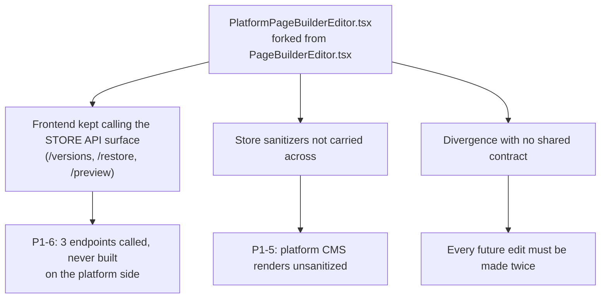

# 05 · P3 — Hygiene, Dead Code, and Stale Docs

**Audit date:** 2026-08-24 · **Commit:** `898bca6` · [← Index](./README.md)

None of these break anything. All of them slow down the next person who touches the codebase — including future you.
Grouped by kind, ordered by how actively misleading they are.

---

## 1. Committed scratch files at repo root (~600 KB)

These should never have been committed. They are working files left in place.

| File | Size | What it is |
| --- | --- | --- |
| `old_admin.ts` | 188 KB | Prior version of an admin module |
| `temp_original_settings.tsx` | 141 KB | Snapshot of a settings component |
| `page_diff.txt` | 75 KB | A saved diff |
| `old_admin_svc.ts` | 29 KB | Prior admin service |
| `h -c git diff --stat 2?&1` | 4 KB | A file **named after a shell command** — a redirect that went to a filename |
| `env-vars.json` | — | Exported env var listing — **check this for secrets before deleting** |
| `temp_old_settings.tsx` | — | Another settings snapshot |

### How to fix ⚡

```bash
git rm "old_admin.ts" "old_admin_svc.ts" "temp_original_settings.tsx" \
       "temp_old_settings.tsx" "page_diff.txt" "h -c git diff --stat 2?&1"
# inspect env-vars.json for credentials first, then:
git rm "env-vars.json"
```

> [!CAUTION]
> `env-vars.json` may contain real credentials. Open it and check before deleting, and if it does, treat those
> secrets as compromised and rotate them — a committed secret is in git history even after `git rm`.

---

## 2. Nine overlapping planning / audit documents

No single source of truth. Each of these claims to describe project status; they disagree with each other and with
reality.

| Doc | Size |
| --- | --- |
| `implementation_plan.md` | 95 KB |
| `memories-summary.md` | 47 KB |
| `STOREFRONT_AUDIT_REPORT.md` | 36 KB |
| `todo.md` | 23 KB |
| `AUDIT_REPORT.md` | — |
| `tasklist.md` | — |
| `PROJECT.md` | — |
| `PandaMarket Ads implementation plan_todo.md` | — |
| `AUDIT_REPORT_2026-08-03.md` | — |

### How to fix

Consolidate into one `docs/STATUS.md` plus an `docs/archive/` folder for the historical ones ([E20](./07-ENHANCEMENTS.md)).
This audit folder (`tabitoken opus 5 audit 24082026`) can serve as the current authoritative snapshot.

---

## 3. Stale claims that will mislead the next contributor

| Doc says | Reality |
| --- | --- |
| `README.md`: Next.js 14 | `next@16.2.4`, React 19.2.4 |
| `README.md`: "5 SQL migrations, 20+ tables" | 95 migrations, 120 tables |
| `README.md` lines 201-298 | Leftover **GitLab CI** template boilerplate; references the GitLab remote while `REMOTE_CREDENTIALS.md` mandates GitHub `github/main`. `.gitlab-ci.yml` (6 KB) still present. |
| `todo.md`: "99%+ MVP complete, 0 gaps" (last touched 2026-05-23) | Contradicted by every P0/P1 in this audit |
| `PROJECT.md`: M1 IN_PROGRESS, M2/M3 PLANNED | Admin products page exists and ships |

### How to fix ⚡

Correct the README's version and migration claims, strip the GitLab boilerplate (lines 201-298), and remove
`.gitlab-ci.yml` since the project is on GitHub. Delete or archive the stale `todo.md` / `PROJECT.md` status
claims.

---

## 4. Untracked files not gitignored

`frontend/playwright-report/` is untracked and **not** in `.gitignore` — it is the only untracked entry in
`git status`. It should be ignored (it is a build artifact) and, separately, wired into CI ([M14](./06-MISSING-WORK.md)).

### How to fix ⚡

```diff
 # .gitignore
+frontend/playwright-report/
+frontend/test-results/
```

---

## 5. Monolithic files

Not defects, but where regressions will hide. Ordered by size.

| File | Size / lines | Note |
| --- | --- | --- |
| `admin.route.ts` | 243 KB / 6,882 lines / 225 routes | Split by domain ([E15](./07-ENHANCEMENTS.md)) |
| `analytics.service.ts` | 203 KB | Split by report family ([E16](./07-ENHANCEMENTS.md)) |
| `order.service.ts` | 102 KB | Read-only-audited in part; more to find here |
| `ai.route.ts` | 80 KB | Entirely inert until an AI key is set |
| `hub/dashboard/products/page.tsx` | >6,900 lines | Single client component ([E22](./07-ENHANCEMENTS.md)) |

---

## 6. The near-duplicate page builders — the root-cause finding

| File | Lines | Bytes |
| --- | --- | --- |
| `PageBuilderEditor.tsx` | 4,325 | 231,103 |
| `PlatformPageBuilderEditor.tsx` | 4,325 | 230,926 |

`Compare-Object` shows only **32 differing lines out of 4,325 — 99.3% identical.** This single copy-paste is the
mechanism behind three separate findings:



### How to fix

Extract the ~4,293 identical lines into one component with a `mode: 'store' | 'platform'` prop
([E17](./07-ENHANCEMENTS.md)). Listed as backlog on effort grounds, but it is the highest-leverage refactor in the
codebase — it retires the *source* of P1-5 and P1-6 rather than patching their symptoms.

---

## 7. Dead and missing routes

| Path | State | Note |
| --- | --- | --- |
| `frontend/src/app/dashboard/loyalty/page.tsx` | 420 B redirect stub → `/hub/dashboard/loyalty` | Fine as a shim; document or remove |
| `frontend/src/app/dashboard/subscribers/page.tsx` | 424 B redirect stub → `/hub/dashboard/subscribers` | Same |
| `/hub/products` | **404 live** | No index route; only `hub/products/[id]`. `/hub/search` and `/hub/category/[slug]` cover the need, but `/hub/products` is the URL a user types, and two test files reference it ([M10](./06-MISSING-WORK.md)) |

---

## 8. Test quality

417 frontend tests pass, but with numerous unwrapped-`act()` warnings (worst offender:
`ads-campaign-wizard.test.tsx`). These mask real async-state bugs — a component updating state outside `act()` is
often a component with an effect that fires when you do not expect it.

Backend `npm test` requires a `check-test-services.ts` precheck implying live Postgres/Redis, so backend tests are
not hermetic and could not be run during this audit ([see 11-VERIFICATION-GAPS.md](./11-VERIFICATION-GAPS.md)).

### How to fix

Wrap the offending state updates in `act()` / `await waitFor(...)` before they hide a real regression. Consider a
test-time Postgres/Redis via Testcontainers so the backend suite is hermetic and CI-runnable.

---

## Consolidated P3 checklist

- [ ] ⚡ `git rm` the 7 scratch files (check `env-vars.json` for secrets first)
- [ ] ⚡ Add `playwright-report/` and `test-results/` to `.gitignore`
- [ ] ⚡ Fix README: Next 16 (not 14), 95 migrations / 120 tables (not 5 / 20+)
- [ ] ⚡ Strip GitLab boilerplate from README lines 201-298; remove `.gitlab-ci.yml`
- [ ] Consolidate 9 planning docs → `docs/STATUS.md` + `docs/archive/`
- [ ] Document or remove the 2 dead `dashboard/*` redirect stubs
- [ ] Fix the unwrapped `act()` warnings, starting with `ads-campaign-wizard.test.tsx`
- [ ] (Backlog) Deduplicate the two page builders behind a `mode` prop
- [ ] (Backlog) Split `admin.route.ts`, `analytics.service.ts`, `hub/dashboard/products/page.tsx`
